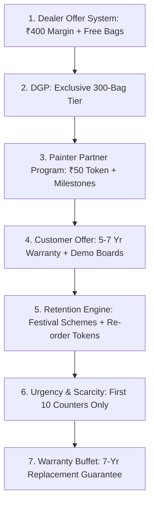

# Alex Hormozi Master Offer Engine & Execution SOP
## Swatch Paints — Sales & Negotiations Division Standard Operating Procedure (v3.0)

---

### 📌 Document Details
- **Author**: Alex Hormozi (Offer Architect & Dealership Programs Designer)
- **Division**: Sales & Negotiations Division
- **Collaborating Legends**: Brian Tracy (CSO), Jordan Belfort (Closing Funnel), Jeremy Miner (NEPQ), Neil Rackham (SPIN), Warren Buffett (CFO)
- **Target Audience**: Field Sales Executives, Area Sales Managers, Dealer Partners, Painting Contractors
- **Territory**: Rajasthan (Bundi HQ, Kota Hub, Hadoti Region City Trade Centers)
- **Status**: Registered for CEO Ashutosh Sharma Signoff (`PENDING_CEO_APPROVAL`)

---

## 1. Executive Purpose & The Core Philosophy

In traditional paint sales, representatives compete by pleading for shelf space or dropping prices. This ruins company margins and makes the brand look desperate.

The **Alex Hormozi Offer Engine** builds a stack of commercial advantages so comprehensive, risk-free, and profitable that the dealer feels foolish refusing it:

> *“Make the offer so good people feel stupid saying no.”*  
> *“You are not in the paint business. You are building a Profit Distribution System.”*

---

## 2. The Hormozi Value Equation for Rajasthan Retail Trade

$$\text{Perceived Value} = \frac{\text{Dream Outcome} \times \text{Perceived Likelihood of Success}}{\text{Time Delay} \times \text{Effort \& Risk}}$$

| Equation Variable | Dealer Reality | How Swatch Maximizes Value |
| :--- | :--- | :--- |
| **Dream Outcome ↑** | High net profit without dead stock | **₹350–₹450 net margin/bag** (vs ₹45 in legacy brands) |
| **Likelihood of Success ↑** | Guaranteed sales rotation | **₹50 cash token in every bag** pulling painters directly to counter |
| **Time Delay ↓** | Fast capital velocity | **Next-day dispatch** + fast 7-day payment cycle (2% CD) |
| **Effort & Risk ↓** | Zero capital lockin & dead inventory | **Zero tinting machine investment** + **7-day stock exchange guarantee** |

---

## 3. The 7-Layer Core Offer Stack (Field Execution SOP)

### Layer 1: Dealer Offer System (High Profit + Zero Risk)
- **Standard Slabs**:
  - **20-Bag Shubh Aarambh Trial**: Get **1 Bag 100% FREE** (Effective cost drops to ₹608/bag).
  - **50-Bag Commercial Expansion**: Get **3 Bags 100% FREE** (Effective cost drops to ₹601/bag).
- **Risk Reversal Policy**:
  - Unopened slow-moving bags can be exchanged within **7 days** with zero deduction.
  - Zero tinting machine investment: Factory-formulated quartz delivers identical viscosity every batch.

### Layer 2: Dealership Growth Program (DGP)
- **Tier 1 (Starter)**: 20-bag trial on COD / 100% advance terms.
- **Tier 2 (Exclusive VIP Partner)**: 300 bags/month committed volume across city territory.
- **VIP DGP Privileges**:
  - **Exclusive Territory Protection**: Company guarantees no other retail dealer within a 1.5 km radius.
  - **Extra ₹30/bag Quarterly Growth Rebate** credited upon volume milestone achievement.
  - **Architectural Storefront Branding**: 10ft $\times$ 4ft Swatch Experience Display board installed at factory cost.
  - **Priority Factory Dispatches** with guaranteed 12-hour turnaround.

### Layer 3: Painter Partner Program (The Demand Pull Strategy)
- **Instant Cash Tokens**: Every 25kg bag of Swatch Rustic contains a crisp **₹50 cash token** redeemable immediately.
- **Annual Milestone Rewards Ladder**:
  - **100 Coupons**: **₹2,500 Cash Bonus**
  - **250 Coupons**: **₹7,000 Cash Bonus**
  - **500 Coupons**: **₹15,000 Cash Bonus**
  - **1,000 Coupons**: **₹35,000 Cash Bonus + Commemorative Silver Token**
- **Community Loyalty Reinforcement**:
  - Monthly Painter Meets at dealer counters (Tea, snacks, technique demonstrations).
  - "Top Thekedar of the Month" memento and social media feature.

### Layer 4: Customer Offer System (Trust & Prestige)
- **5–7 Year Durability Written Assurance**: Weatherproof, anti-algal, quartz-locked bond.
- **Next Purchase Loyalty Voucher**: 5% discount coupon on subsequent interior/exterior paint requirements.
- **Physical Demonstrations**: Free 1ft $\times$ 1ft authentic quartz display boards + free 2ft $\times$ 2ft on-site demo patch.

### Layer 5: Retention & Repeat Engine (Seasonal Bonanzas)
- **Continuous Retention**: Every reorder generates new painter coupons and dealer trade discounts.
- **Festival Accelerators**:
  - **Diwali Shubh Labh Bonanza**: Buy 50 bags $\to$ Get 5 bags free + Dealer Gift Hamper.
  - **Holi Rangkari Scheme**: Double painter coupon (₹100/bag) for 15 days pre-Holi.

### Layer 6: Tactical Urgency & Scarcity (Dan Kennedy Integration)
- Field representatives must never offer unlimited open-ended terms.
- **Approved Scarcity Triggers**:
  - *"Sir ye 20-bag trial par 1 bag free ka offer factory launch allocation ke tahet sirf is Sunday shaam 6:00 baje tak valid hai."*
  - *"Kota market me hum sirf pehle 10 exclusive retail counters ko Area Protection de rahe hain — 6 counters already lock ho chuke hain."*

### Layer 7: Warranty Buffet (Zero Risk Elimination)
- **7-Year Weatherproof Durability Assurance**.
- **100% Free Replacement Guarantee** on any verified factory batch defect.
- **Zero Color Fade Assurance** utilizing natural graded quartz aggregates without cheap artificial dyes.

---

## 4. Field Word-for-Word Scripts (Normal vs Hormozi Stack)

### ❌ The Ordinary Pitch (Triggers Resistance):
> *"Namaste sir, Swatch Rustic texture le lo, ₹700 per bag padega aur product bahut accha hai."*  
> *(Dealer: "Nahi bhai, abhi zarurat nahi hai, Asian hi chal raha hai.")*

### ✅ The Hormozi No-Brainer Value Stack Script:
> *"Namaste [Dealer Name] ji! Hum rate bechne nahi, aapki dukan ka profit double karne aaye hain. Simple calculation dekhiye:  
> 
> 1. Counter par per bag **₹400 ka direct clean profit** mil raha hai.  
> 2. Har bag me **₹50 ka painter cash coupon** hai — thekedar khud aapki dukan par aakar maangega.  
> 3. **20 bag ke trial par 1 bag company ki taraf se 100% FREE** mil raha hai.  
> 4. Agar 7 din me stock move na ho, toh **100% exchange guarantee** hai — aapka ₹1 bhi block nahi hoga.  
> 5. Aapke town me aapko **Exclusive Area Protection** milega.  
> 6. Aur customer ko hum **7 saal ki written durability assurance** de rahe hain.  
> 
> Sir, ₹400 margin, zero inventory risk, painter pull aur free bags — ab aap khud bataiye, is deal ko na lene me koi logic banta hai kya?"*

---

## 5. Collaboration Sales Flow

$$\text{Hook (Belfort)} \longrightarrow \text{Questions (NEPQ)} \longrightarrow \text{Pain (SPIN)} \longrightarrow \mathbf{\text{Offer (Hormozi)}} \longrightarrow \text{Comfort Close (Belfort + NEPQ)}$$

1. **Belfort Hook**: Captures sharp 4-second executive attention.
2. **NEPQ Questions**: Disarms defensiveness by asking about current margin satisfaction.
3. **SPIN Pain**: Multiplies current low margin into an undeniable ₹17,500/month loss.
4. **Hormozi Offer**: Delivers the irresistible 7-layer stack that solves the pain completely.
5. **Belfort/NEPQ Comfort Close**: Secures the 20-bag Shubh Aarambh starter trial.

---

## 6. Daily Field Quota for Sales Representatives
- **5 Dealers / Day**: Present the 7-Layer No-Brainer Stack.
- **5 Painters / Day**: Explain the Milestone Partner Ladder (₹35,000 cash reward).
- **2 Site Owners / Day**: Demonstrate the 7-Year Warranty Buffet and Quartz Board.
