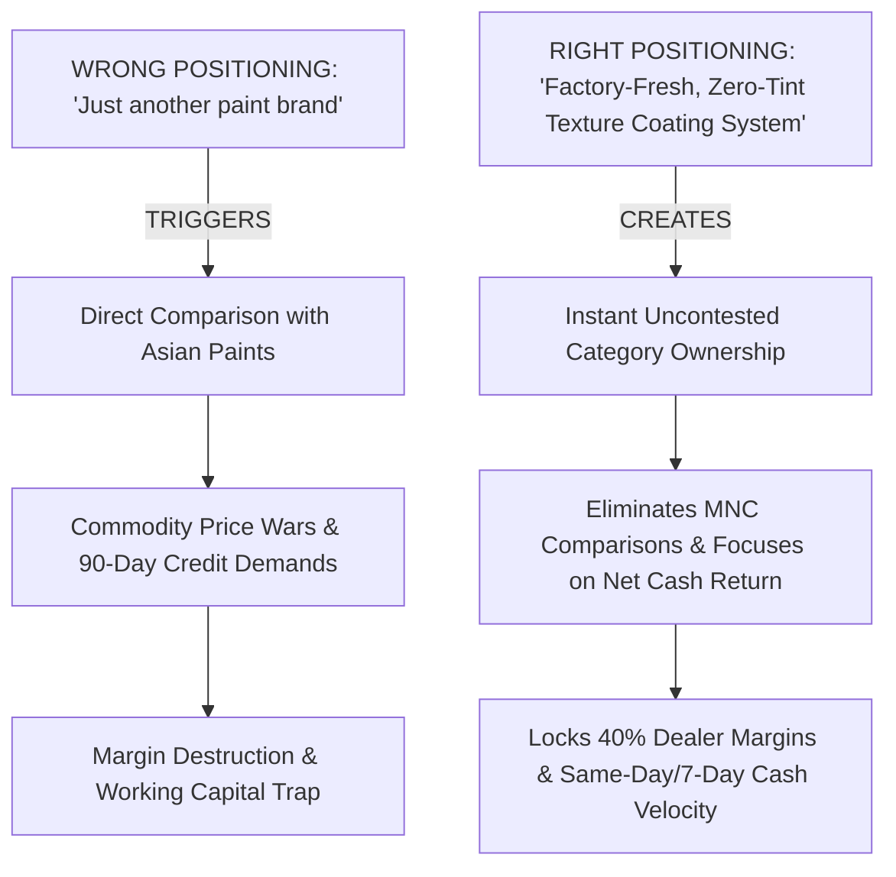
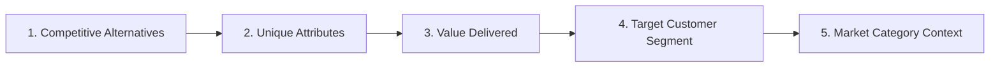

# April Dunford Positioning & Differentiation Master Standard Operating Procedure
## Swatch Paints — Sales & Negotiations Division Master Operating Procedure (v2.0)

---

### 📌 Document Details
- **Legend & Author**: April Dunford (Category Architect & Market Perception Controller)
- **Division**: Sales & Negotiations Division (Pool: `div_sales`)
- **Division Lead**: Brian Tracy (Chief Sales Officer)
- **Collaborating Legends**: Jordan Belfort (Straight Line Closer), Jeremy Miner (NEPQ Questioning), Neil Rackham (SPIN Diagnosis), Keenan (Gap Selling Engine), Alex Hormozi (Offer Architect), Grant Cardone (10X Expansion Multiplier)
- **Target Audience**: CEO Ashutosh Sharma, Executive Leadership, Territory Sales Managers, Field Sales Executives, Independent Wholesale Distributor Sonu Kumar
- **Territory**: Rajasthan Core Trade Corridor (Bundi HQ, Kota Industrial & Commercial Hub, Hadoti Regional Centers)
- **Status**: Registered for CEO Ashutosh Sharma Signoff (`PENDING_CEO_APPROVAL`)

---

## 1. Executive Purpose & Strategic Mandate

Most new manufacturing ventures suffer premature failure not because their chemical formulation is inferior, but because they position themselves in the wrong market category. When a sales executive walks into a retail trade counter and introduces the business as: *“Namaste, hum ek nayi paint company hain aur paint bechte hain,”* the dealer's mind instantly files the product under the mental category labeled: **"Cheap Commodity Paint trying to copy Asian Paints."**

The dealer immediately demands:
- 90-day credit
- 30% price discounts below established brands
- Costly computerized tinting machines
- Free sample giveaways

**April Dunford’s Positioning SOP systematically destroys this commodity trap by creating an uncontested, high-status market category**:
- **“If you are compared, you are commoditized. If you are different, you are chosen.”**
- **“Context sets the value. Frame your product in the wrong category, and even superior quality looks overpriced.”**
- **“Market victories are not won by having the best product; they are won by controlling market perception.”**
- **“Confused positioning leads to zero sales. Crystal-clear positioning makes selling effortless.”**

---

## 2. The 5 Core Components of Positioning (The Obviously Awesome Framework)

### 🟡 1. Competitive Alternatives (What would prospects use if Swatch did not exist?)
- **Tier 1 MNC Texture Products (Asian Paints Apex Duracast, Berger Ruff 'N' Tuff, Nerolac)**:
  - Highly restrictive ₹3.5 Lakh computerized tinting machine requirement.
  - Squeezed dealer margins (barely 3% to 5% net cash margin per can).
  - Slow inventory turnover; tinting bases lock up working capital.
- **Tier 2 Low-Grade Unbranded / Local Formulators**:
  - Inconsistent sand and aggregate grading leading to patchy exterior plaster finishes.
  - Poor binder solids; chalks and flakes under harsh 48°C Rajasthan summer sun.
  - Zero factory technical support; zero warranty backing.
- **Traditional Exterior Emulsions & Distempers**:
  - Flat aesthetic with zero tactile stone depth; vulnerable to structural hairline cracks and water seepage.

---

### 🟢 2. Unique Attributes (What concrete capabilities does Swatch possess?)
1. **Zero Tinting Machine Dependency**: 100% pre-graded, factory-homogenized natural silica quartz aggregate in ready-to-apply 25kg moisture-resistant bags.
2. **Direct-from-Plant Manufacturing**: Dispatched directly from our Bundi production facility, eliminating 3 tiers of corporate bureaucracy and distributor markups.
3. **40% Trade Margin Structure**: Delivers ₹200+ gross profit per 25kg bag to the retail dealer (compared to ₹15–₹30 on multinational brands).
4. **Embedded Painter Loyalty Program**: ₹50 cash token card sealed inside every single bag of Swatch Rustic, instantly driving application preference among mistris.
5. **Architectural Weather Assurance**: Formulated with UV-resistant acrylic co-polymers delivering a 5-Year Weather & Durability Assurance.

---

### 🔵 3. Value Delivered (Why does this unique difference matter commercially?)
- **Elimination of Capital Expenditure**: The dealer avoids locking up ₹3,00,000 to ₹4,00,000 in a tinting dispenser and colorant canisters.
- **5X to 10X Net Margin Velocity**: Selling 100 bags of Swatch Rustic generates **₹40,000 to ₹55,000 in net trade profit**, compared to just **₹3,000 on an equivalent volume of MNC texture**.
- **Rapid Capital Rotation**: Ready bags require no in-shop tinting labor or technician errors. Stock arrives, sells, and turns over 6x faster.

---

### 🟣 4. Target Customer Segment (Who values this difference the most?)
- **Mid-sized Hardware & Mixed Building Material Counters**: Retailers who possess high counter footfall and strong contractor relationships, but refuse to surrender shop floor space or capital to multinational tinting machines.
- **Margin-Conscious Paint Dealers**: Dealers who are tired of acting as unpaid display warehouses for MNCs at 3% margins and desire genuine profitability.
- **Volume Painting Contractors (Thekedars)**: Applicators handling residential bungalows, commercial plazas, and institutional facades who require buttery trowel glide, zero batch shade variation, and direct karigar cash incentives.

---

### 🔴 5. Market Category Context (The Defining Frame)
- ❌ **The Fatal Trap**: *"Sir, hum bhi paint company hain."*
- ✅ **The Winning Category**: **“Factory-Fresh, High-Margin, Zero-Tint Texture Coating System.”**

---

## 3. The Positioning Comparison Matrix

| Business Metric | Generic Paint Brand Model (MNC) | Swatch Zero-Tint Texture System |
| :--- | :--- | :--- |
| **Market Identity** | Commodity Paint Manufacturer | Factory-Fresh Architectural Texture System |
| **Capital Investment** | ₹3.5 Lakh Tinting Machine + Colorants | **₹0 Zero Machine Required** |
| **Dealer Net Margin** | 3% to 5% (₹15–₹30 / unit) | **40% Protected Margin (₹200+ / bag)** |
| **Inventory Risk** | High (tinted mistints cannot be returned) | **Zero (ready-mixed factory bags turn instantly)** |
| **Painter Incentive** | Complex year-end corporate point apps | **₹50 Instant Cash Token Card inside each bag** |
| **Supply Chain Velocity** | 3–5 Days via distant depot hubs | **24-Hour Direct Dispatch from Bundi Plant** |
| **Trade Role** | Passive volume mover for corporate giants | **High-Profit Territory Trade Partner** |

---

## 4. Field Dialogue Scripts & Objection Reframing

### 🎯 Scenario 1: The Dealer Compares Swatch to Asian Paints
- **Dealer Objection**: *“Bhaiya, hamare paas already Asian Paints aur Berger ka texture hai. Log wahi maangte hain. Naya paint brand kyu rakhein?”*
- **Amateur Sales Rep Response (Weak)**: *“Sir hamara paint bhi unke jaisa hi badhiya hai, aur hum aapko unse sasta denge.”*
- **April Dunford Positioning Script (Mastery)**:
  > *“[Dealer Name] ji, aap bilkul sahi keh rahe hain. Asian Paints ek established computerized tinting brand hai. Lekin hum koi paint brand nahi hain jo unse compete karne aaye hain — hum ek completely different business model hain.*  
  > *Wahan aapne ₹3.5 Lakh ki machine lagayi hui hai, shop ka prime space diya hua hai, aur 1 bori par margin milta hai mushkil se ₹25 ya ₹30. Swatch ek **Zero-Investment Texture Coating System** hai jisme aapko ek rupaye ki machine nahi lagani. Shahrukh bhai Bundi plant se pre-graded natural quartz aggregate dispatch karte hain jo ready-mixed hai, aur har single bori par aapko seedha **₹200+ ka net cash profit** milta hai.*  
  > *Aap Asian Paints ko apne brand-conscious customers ke liye chalne dijiye, aur Swatch ko apne counter ki asli net income badhane ke liye rakhiye. Kya counter par ₹40,000 extra monthly income add karna galat hoga?”*

---

### 🎯 Scenario 2: The Confused Dealer
- **Dealer Inquiry**: *“Mujhe samajh nahi aaya, aap emulsion bech rahe ho ya putty?”*
- **April Dunford Positioning Script**:
  > *“[Dealer Name] ji, hum na to normal putty hain aur na standard emulsion. Putty deewar ko sirf level karti hai, aur paint par dhoop me cracks aur fading aati hai.*  
  > *Swatch ek **Factory-Fresh Exterior Quartz Texture System** hai. Yeh natural stone quartz aggregate se banta hai jo seedha plaster par trowel se apply hota hai. Yeh deewar ko natural stone look deta hai, 5 saal tak waterproof aur crack-proof rehta hai, aur isme karigar ke liye ₹50 ka instant token sealed hota hai. Yeh counter par high-ticket, high-margin turnover generate karta hai.”*

---

### 🎯 Scenario 3: The Price Resistance Trap
- **Dealer Objection**: *“Market me local texture bag ₹350 me mil jata hai, aapka rate standard dealer price ₹690 kyu hai?”*
- **April Dunford Positioning Script**:
  > *“[Dealer Name] ji, ₹350 wala maal local sand aur saste chalk powder ka bana hota hai. Jab dhoop padti hai, to 6 mahine me dana jhadne lagta hai aur client contractor aur dealer dono ki payment rok deta hai.*  
  > *Swatch koi sasta local powder nahi hai. Yeh **100% Washed Silica Quartz Aggregate** aur UV-resistant polymers se engineered hai. MRP ₹1,150 hai, aapka purchase price ₹690 hai — yani har bag par aap flat ₹460 ka customer markup aur margin enjoy karte ho. Yeh price nahi hai, yeh counter ki permanent reputation aur 40% clean profit ka entry point hai.”*

---

## 5. Sales Force Messaging Discipline (The 4 Non-Negotiable Rules)

1. **Rule 1: Never Lead with the Word "Paint"**:
   - Strictly avoid: *“Sir hum paint bechte hain.”*
   - Always lead with: *“Sir hum retail counters ke liye ek High-Margin, Zero-Tint Texture System supply karte hain.”*
2. **Rule 2: Control the Vocabulary (No Negative Vernacular)**:
   - Strictly prohibit negative trade words (e.g., never say "mandi"; always use **"B2B Market"** or **"Retail Trade Network"**).
   - Address trade partners respectfully by their registered name: `"[Name] ji"`.
3. **Rule 3: Frame Difference Over Features**:
   - Do not list chemical viscosity numbers or acrylic polymer percentages unless asked.
   - Lead with commercial positioning: **Zero Machine Investment $\to$ 40% Margin $\to$ Pre-Mixed Natural Quartz $\to$ 24-Hr Bundi Dispatch.**
4. **Rule 4: Relentless Consistency**:
   - Every sales rep, brochure, WhatsApp greeting, and invoice description must reinforce the identical category definition. Repetition creates market reality.

---

## 6. Daily, Weekly, and Monthly Positioning Cadence

### 📅 Daily Positioning Routine:
- Deliver the **Zero-Tint Category Reframe** in a minimum of **10 sales interactions**.
- Break commodity comparisons (*“Aap Asian Paints jaise ho?”*) on at least **3 retail counters**.
- Log market perception feedback and competitive objections in CRM (`users.csv`).

### 📆 Weekly Positioning Calibration:
- Audit field sales objections with Chief Sales Officer Brian Tracy.
- Refine objection response scripts based on emerging competitor counter-claims.
- Conduct a 15-minute roleplay drill testing rep delivery of the Scenario 1 MNC reframe script.

### 🗓️ Monthly Category Ownership Audit:
- Survey active dealers to measure category perception: Do they refer to Swatch as "just another paint" or as "the high-margin texture system"?
- Update territory marketing collateral, counter boards, and product brochures to reinforce category leadership.
- Present market perception analytics directly to CEO Ashutosh Sharma.

---

## 7. What April Dunford Positioning Will NEVER Do
- ❌ **NEVER engage in commodity price wars** against low-grade local formulators.
- ❌ **NEVER accept the label of "another small paint company"** trying to copy Asian Paints.
- ❌ **NEVER overwhelm the dealer with technical chemical jargon** before establishing category value.
- ❌ **NEVER violate the factory hurdle rate** ($\ge ₹100/\text{bag}$ net profit on Swatch Rustic).
- ❌ **NEVER allow inconsistent messaging** across different field sales executives.

---

## 8. Integration Flow with the Sales & Negotiations Stack

$$\mathbf{\text{April Dunford (Positioning)}} \longrightarrow \text{Belfort (Script)} \longrightarrow \text{NEPQ (Questions)} \longrightarrow \text{SPIN (Pain)} \longrightarrow \text{Keenan (Gap)} \longrightarrow \text{Hormozi (Offer)} \longrightarrow \text{Cardone (Scale)}$$

1. **April Dunford**: Defines the uncontested category (*Factory-Fresh, Zero-Tint Texture System*).
2. **Jordan Belfort**: Delivers the Straight Line pitch with absolute certainty in this unique positioning.
3. **Jeremy Miner (NEPQ)**: Asks disarming questions probing the dealer's dissatisfaction with low-margin MNC machines.
4. **Neil Rackham (SPIN)**: Diagnoses the financial hemorrhage caused by locked machine capital and delayed dispatches.
5. **Keenan (Gap Selling)**: Calculates the exact ₹4.44 Lakh annual gap between current 3% margins and Swatch 40% margins.
6. **Alex Hormozi**: Presents the risk-free Grand Slam starter batch offer with 100% guarantee.
7. **Chris Voss**: Employs tactical empathy to protect pricing and prevent discounting requests.
8. **Grant Cardone**: 10Xs field activity, visibility, and follow-ups to achieve total territory saturation.
9. **Joe Girard**: Retains the account for life through prompt 7-day payment discipline and relationship loyalty.
