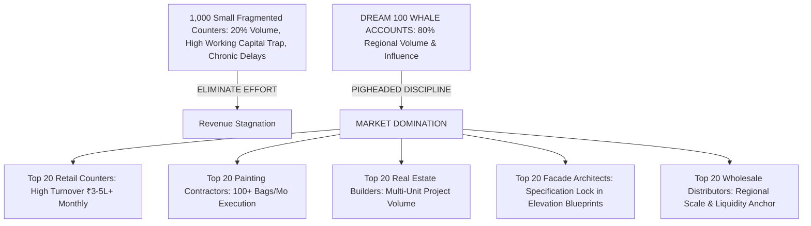
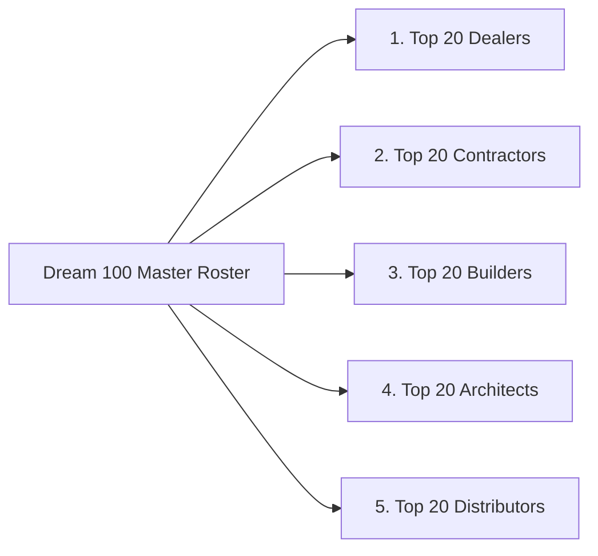
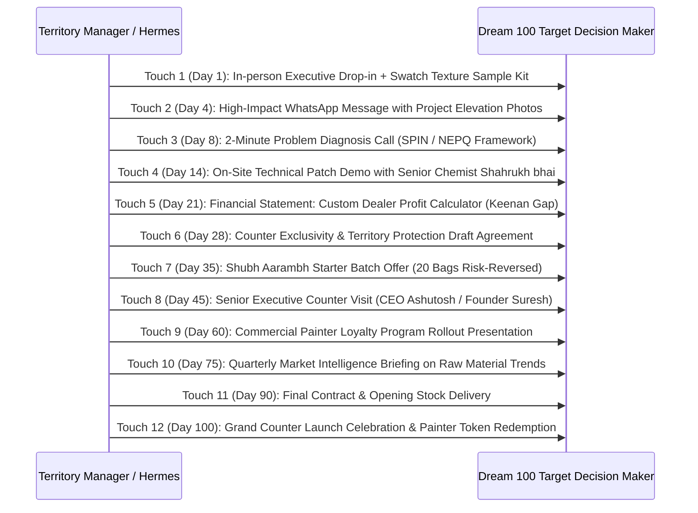

# Chet Holmes Dream 100 Market Domination & Growth Strategy SOP
## Swatch Paints — Sales & Negotiations Division Master Operating Procedure (v2.0)

---

### 📌 Document Details
- **Legend & Author**: Chet Holmes (Market Domination Strategist & Dream 100 Growth Architect)
- **Division**: Sales & Negotiations Division (Pool: `div_sales`)
- **Division Lead**: Brian Tracy (Chief Sales Officer)
- **Collaborating Legends**: John McMahon (Target Qualification), Jeb Blount (Bulk Prospecting), Alex Hormozi (Offer Architect & Slabs), Jordan Belfort (Straight Line Closer), Joe Girard (Relationship Manager & Retention), Chris Voss (Negotiations)
- **Target Audience**: CEO Ashutosh Sharma, Executive Leadership, Territory Managers, Institutional Sales Reps
- **Territory**: Rajasthan Core Corridor (Bundi HQ, Kota Industrial & Commercial Hub, Hadoti Regional Centers)
- **Status**: Registered for CEO Ashutosh Sharma Signoff (`PENDING_CEO_APPROVAL`)

---

## 1. Executive Purpose & Strategic Mandate

Most manufacturing sales forces suffer from **"The 1,000 Small Account Trap"**:
They dispatch field reps to chase 1,000 small, unenthusiastic retail shop counters who buy 5 bags on 90-day credit, generate endless payment disputes, and demand constant price slashing. The result is bloated logistics costs, high credit defaults, and exhausted sales reps.

**Chet Holmes’ Dream 100 SOP engineers ruthless Market Domination through Pigheaded Discipline and Razor-Sharp Focus**:
- **“Focus on the best… ignore the rest.”**
- **“Top 100 control $\longrightarrow$ Market control.”**
- **“Market sabka nahi hota — market top players ka hota hai.”**
- **“Pigheaded discipline and determination will always beat raw sales talent.”**
- **The Core Rule**: 80% of regional coating volume is controlled by the top 100 players in the territory. By securing 30 to 40 of these 100 whales, Swatch Paints becomes the **#1 dominant player** in the territory, locking out competition and securing unmatched trade profitability.



---

## 2. The Dream 100 Structure (5 Cohorts × 20 Whales = 100 Targets)



### 🟡 1. TOP 20 RETAIL DEALERS (Ground Counter Domination)
- **Profile**: Primary commercial high-street location, ₹3,00,000–₹5,00,000+ monthly paint turnover, large painter network visiting counter daily.
- **Criteria**: Solid payment track record, willingness to dedicate 1 premium front display bay.
- **Domination Hook**: 
  > *“Sir hum har gali me board nahi baant rahe. Har prime market me sirf 1 top dealer ko territory exclusivity de rahe hain. Aapke counter ke alawa yeh product pure market me kisi doosri dukaan par nahi milega.”*

---

### 🟢 2. TOP 20 PAINTING CONTRACTORS / THEKEDARS (Application Volume Pull)
- **Profile**: 15–40 painters on direct payroll; manages major township, mall, and institutional elevation coatings. Consumes 100–300 bags/month.
- **Criteria**: Technical appetite for silica quartz trowel glide and open-time setting.
- **Domination Hook**:
  > *“Har 25kg Swatch Rustic bori ke andar ₹50 instant cash token card aapke karigar ke liye, plus batch-to-batch 100% color and aggregate consistency guaranteed.”*

---

### 🔵 3. TOP 20 REAL ESTATE BUILDERS & DEVELOPERS (Project BOQ Volume)
- **Profile**: Active residential townships, commercial complexes, or educational campuses requiring $\ge 1,000$ bags per project phase.
- **Criteria**: Decision-maker focused on lowering total landed square-foot cost while securing 5-year weather assurance.
- **Domination Hook**:
  > *“Direct factory-landed supply delivering 30% reduction in total exterior coating expenditure with a written 5-Year Weather & Durability Assurance.”*

---

### 🟣 4. TOP 20 ELEVATION ARCHITECTS & SPECIFIERS (The Blueprint Gatekeepers)
- **Profile**: Prominent regional architectural firms designing facade blueprints for high-visibility landmarks and commercial spaces.
- **Criteria**: Aesthetic design preference for natural silica quartz texture over synthetic flat plastic paints.
- **Domination Hook**:
  > *“Swatch Architectural Texture Sample Kit + custom aggregate micron grading for natural, zero-gloss stone elevation finishes.”*

---

### 🔴 5. TOP 20 WHOLESALE DISTRIBUTORS (Regional Logistics Scalers)
- **Profile**: Established B2B trade distributors with distribution logistics, warehouse space, and strong retail dealer networks.
- **Criteria**: Commitment to move $\ge 200$ bags/month with prompt cash payment discipline.
- **Domination Hook**:
  > *“Wholesale transfer price of ₹430/bag with strictly protected city territory exclusivity (e.g. Sonu Kumar model). Zero competing distributors in your assigned city.”*

---

## 3. Deep Account Intelligence Matrix

Field representatives must never visit a Dream 100 target blind. The following data points must be verified and logged into `chet_holmes_dream100_target_ledger.csv`:

```
┌─────────────────────────────────────────────────────────────────────────────┐
│                       DEEP ACCOUNT INTELLIGENCE RECORD                      │
├───────────────────────┬─────────────────────────────────────────────────────┤
│ Target Name & Firm    │ [Firm Name] — [Key Decision Maker Name]            │
│ Cohort Classification │ Retail Dealer / Contractor / Builder / Architect    │
│ Estimated Monthly Vol │ [e.g. 150 Bags Texture + 40 Buckets Emulsion]       │
│ Incumbent Brands Used │ [Asian Paints Apex, Berger Walmasta, Sika, etc.]   │
│ Current Buying Margin │ [e.g. 3-5% on MNC paints, 30-40% on hardware]       │
│ Core Trade Frustration│ Low profit margins, delivery delays, chalking       │
│ Key Value Driver      │ High net profit, territory exclusivity, prestige    │
│ Current Touch Stage   │ Touch 1 to 12 (Log date, channel, and feedback)     │
└───────────────────────┴─────────────────────────────────────────────────────┘
```

---

## 4. The 7–12 Touchpoint "Pigheaded Discipline" Value Cadence

Whale accounts do not switch suppliers easily. Studies show that 80% of major accounts convert between the 5th and 12th touchpoint. Abandoning a prospect after 2 visits is amateur behavior.



---

## 5. Sales Data Analysis & Gold Metrics System

Chet Holmes mandates that market domination is managed through **unforgiving arithmetic**:

### 📊 The 4 Gold Domination Metrics:
1. **Revenue per Dream 100 Account**:
   - **Target**: $\ge ₹1,50,000$ per month per active Dream 100 account.
   - **Action**: Any account doing $< ₹50,000/\text{month}$ for 2 consecutive months is audited, retrained, or replaced.
2. **Repeat Re-order Rate**:
   - **Target**: $\ge 75\%$ re-ordering within 30 days of initial invoice.
   - **Action**: If repeat drops below 70%, trigger Senior Chemist Shahrukh bhai to inspect on-site application quality.
3. **Average Order Size (AOS)**:
   - **Target**: $\ge 50$ Bags for Texture; $\ge 20$ Buckets for Emulsions.
   - **Action**: Secures logistics freight efficiency (capped at ₹30/bag).
4. **Hurdle Net Margin per Unit**:
   - **Target**: $\ge ₹100/\text{bag}$ net company profit on Swatch Rustic; $\ge ₹132/\text{bag}$ on Swatch Roller Coat.
   - **Action**: Strictly locks out unapproved discounts; preserves factory profitability.

---

## 6. Daily, Weekly, and Monthly Operational Cadence

### 📅 Daily Dream 100 Routine (Field Reps & Territory Managers):
1. **5 Contact Touches**: Engage 5 separate Dream 100 targets (via phone call, WhatsApp case study, or site stop).
2. **2 High-Value Meetings**: Conduct deep-dive commercial negotiations or on-site demonstration patches.
3. **1 Deep Follow-Up**: Deliver a custom profit comparison statement, sample kit, or elevation case study.
4. **CRM Update**: Record every interaction, objection, and scheduled next step in the CRM ledger.

### 📆 Weekly Territory Review:
1. Review the **Top 20 Leaderboard** by volume and engagement with CEO Ashutosh Sharma.
2. Identify stalled accounts (stuck at Touch 3 for $> 21$ days) and deploy an executive intervention.
3. Disqualify unengaged accounts and elevate pre-qualified reserves into the active Dream 100 roster.

### 🗓️ Monthly Market Domination Roadmap:
1. Conduct deep sales data analytics: Total pipeline value, active accounts, monthly repeat rate, average order size.
2. Formulate the next month's growth targets and production forecasts with plant personnel.
3. Present the **Executive Sales Growth Briefing** directly to CEO Ashutosh Sharma.

---

## 7. Field Negotiation Scripts by Scenario

### 🎯 Scenario 1: Top High-Street Dealer (High Footfall, Skeptical of New Brand)
- **Opening**:
  > *“[Dealer Name] ji, Namaste. Main aapka kimti samay lene nahi aaya hoon. Hum Rajasthan me random tareeqe se har gali me dealer nahi bana rahe. Swatch Paints har shahar ke sirf top 1 ya 2 counters ke saath exclusive tie-up kar raha hai, aur aapka counter hamari priority list me sabse upar hai.*  
  > *MNC brands par aapko 3% margin milta hai aur payment mahino atka rehta hai. Swatch ke saath aap 40% margin kamaoge aur har bag par net profit ₹150–₹200 hoga, plus aapke 2km ke radius me koi doosra dealer hamara maal nahi bech sakta. Kya hum 10 minute baithkar iska exact calculation dekh sakte hain?”*

---

### 🎯 Scenario 2: Large Commercial Contractor (Quality & Labor Conscious)
- **Opening**:
  > *“[Contractor Name] ji, Namaste. Aapki is site par elevation work bahut solid dikh raha hai. Ek bat bataiye — dhoop me kaam karte waqt agar texture jaldi sookh jaye to karigar par kitna load aata hai? Aur agar deewar par dana alag alag dikhe to client payment rokta hai ya nahi?*  
  > *Shahrukh bhai ne Bundi factory me 100% washed silica quartz aggregate se Swatch Rustic banaya hai jo makkhan ki tarah chalta hai. Plus har bori me ₹50 ka cash token aapke karigar ko seedha milta hai. Chaliye 1 deewar par live demo patch lagate hain — agar aapke mistri ne nahi kaha ki ye best hai, to hum aapse ek paisa nahi lenge.”*

---

### 🎯 Scenario 3: B2B Wholesale Distributor (Volume & Territory Protection)
- **Opening**:
  > *“[Distributor Name] ji, Namaste. B2B wholesale trade me sabse bada nuksan tab hota hai jab aap 200 bori bechte ho aur margin milta hai ₹10-15 bori, aur agle mahine wahi brand aapke padosi ko bhi maal de deta hai.*  
  > *Swatch independent wholesale model par chalta hai: ₹430/bag direct factory transfer rate, dedicated city market exclusivity, aur aap sub-dealers ko 40% margin dene ke baad bhi har bori par solid net cash profit kamaoge. Shart sirf ek hai — monthly committed volume 200 bags aur payment discipline. Kya hum distribution agreement review karein?”*

---

## 8. Prohibited Practices (What Chet Holmes Will NEVER Do)
- ❌ **NEVER chase 1,000 small, unenthusiastic retail shops** that consume sales bandwidth with zero ROI.
- ❌ **NEVER abandon a qualified whale target** before completing at least 7 to 12 high-value touchpoints.
- ❌ **NEVER accept unmeasured, gut-feel sales performance** without hard weekly and monthly data logging.
- ❌ **NEVER violate the factory hurdle rate** ($\ge ₹100/\text{bag}$ net margin).
- ❌ **NEVER use negative trade terminology** (strictly avoid "mandi"; use "B2B Market" or "Retail Trade Network").
- ❌ **NEVER address trade partners disrespectfully** (always use `"[Name] ji"`, never colloquial slang like "Ustaad").

---

## 9. Integration with the Full Sales Stack

$$\text{John McMahon (Filter)} \longrightarrow \mathbf{\text{Chet Holmes (Dream 100 Focus)}} \longrightarrow \text{Jeb Blount (Prospect)} \longrightarrow \text{Keenan (Gap)} \longrightarrow \text{Belfort (Close)} \longrightarrow \text{Joe Girard (Retain)}$$

1. **John McMahon (MEDDPICC)**: Filters out low-value accounts; qualifies only genuine decision-makers with budget.
2. **Chet Holmes (Dream 100)**: Focuses organizational energy exclusively on the top 100 whales and runs the multi-touch cadence.
3. **Jeb Blount (Prospecting)**: Drives indirect demand pull through architects, interior designers, and contractors.
4. **Neil Rackham & Jeremy Miner (SPIN / NEPQ)**: Asks diagnostic questions to reveal hidden pain and financial loss.
5. **Keenan (Gap Selling)**: Quantifies the cost of inaction and calculates the ₹ gap between current state and desired state.
6. **Alex Hormozi (Offers)**: Delivers irresistible Grand Slam offers with unbeatable margins and risk reversal.
7. **Chris Voss (Negotiation)**: Employs tactical empathy to protect pricing without giving away margin.
8. **Jordan Belfort (Straight Line)**: Executes the final closing sequence with absolute certainty in Product, Company, and Salesman.
9. **Joe Girard (Retention & Payment)**: Enforces the 7-day payment cycle and builds lifelong customer loyalty.
