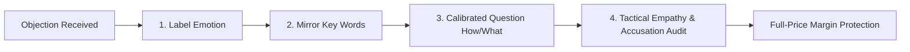

# Chris Voss Tactical Empathy & Dynamic Negotiation SOP
## Swatch Paints — Sales & Negotiations Division Standard Operating Procedure (v2.0)

---

### 📌 Document Details
- **Author**: Chris Voss (Negotiation Specialist & Tactical Empathy Expert)
- **Division**: Sales & Negotiations Division
- **Collaborating Legends**: Brian Tracy (CSO), Jordan Belfort (Straight Line Funnel), Jeremy Miner (NEPQ), Neil Rackham (SPIN), Alex Hormozi (Offer Architect)
- **Connected Personnel**: Internal Field Sales Executives, Independent Distributor (Sonu Kumar), Territory Managers
- **Territory**: Rajasthan (Bundi HQ, Kota Hub, Hadoti Regional City Markets)
- **Status**: Registered for CEO Ashutosh Sharma Signoff (`PENDING_CEO_APPROVAL`)

---

## 1. Executive Purpose: Why Scripts Fail in Negotiation

When a prospect raises an objection, they are operating from their emotional brain (the amygdala). If a sales representative responds with a recited script or an argument, the prospect perceives manipulation, activates defense mechanisms, and shuts down the deal.

**The Chris Voss System replaces rigid scripts with dynamic psychological tools**:
- **Listen 70% of the time, speak 30% of the time.**
- **Label** their hidden emotion so they feel completely understood.
- **Mirror** their words so they voluntarily reveal their true reservations.
- **Ask Calibrated Questions** so they solve their own problems without requesting price cuts.
- **Protect Company Margins**: Strictly zero unapproved discounting.

> *“He who controls the emotions… controls the deal.”*  
> *“Amateurs argue. Professionals label, mirror, and understand.”*

---

## 2. The 5 Core Dynamic Negotiation Tools

### Tool 1: Labeling (Neutral Emotional Identification)
- **Method**: Never tell the dealer what they *are*; observe what it *looks like* they are feeling.
- **Forbidden Phrases**: *"Main janta hoon aap kya feel kar rahe ho"* (triggers anger).
- **Approved Openers**: *"Lag raha hai..."*, *"Aisa lagta hai..."*, *"Aapko aisa feel ho raha hai..."*
- **Followed by**: **Complete Silence**. Let the label sink in.

### Tool 2: Mirroring (The 3-Word Reflection)
- **Method**: Repeat the last 1 to 3 critical words spoken by the dealer with a gentle, curious upward pitch (like asking a question).
- **Effect**: It acts as an acoustic nudge. The dealer feels compelled to elaborate, revealing the root objection.

### Tool 3: Calibrated Questions (The "How" and "What" Power Questions)
- **Strict Rule**: **NEVER ask "Why"** (*"Aap naya brand kyu nahi lete?"* sounds accusatory).
- **Use "How" and "What"**:
  - *"Hum aisa kya kar sakte hain ki ye trial aapke counter ke liye comfortable ho jaye?"*
  - *"Aapke hisaab se cash flow aur margin ka balance kaise banta hai?"*
  - *"Is 20-bag starter trial ko start karne me sabse bada obstacle kya dikh raha hai?"*

### Tool 4: Tactical Empathy & Tone of Voice
- **The Late-Night FM DJ Voice**: Speak slowly, calmy, and downward at the end of sentences. An unhurried tone signals supreme confidence and emotional safety.
- **Acknowledge Pressure**: *"Samajh sakta hoon sir, 20 saal ki dukan par naye texture brand par risk lena koi aasan faisla nahi hota."*

### Tool 5: Accusation Audit (Pre-Emptive Defusal)
- **Method**: Name all negative assumptions the prospect has before they can voice them.
- **Effect**: Disarms skepticism. When you call out your own potential weaknesses, the prospect feels compelled to defend you or soften their stance.

---

## 3. Real-World Grounded Scenarios in Rajasthan Paint Trade

---

### 💣 SCENARIO 1: “Price High Hai / Rate Zyada Hai”

- **❌ WRONG (Amateur Script)**:  
  *“Sir price mat dekho, margin dekho. Hamari quality Asian Paints se better hai.”*  
  *(Result: Dealer argues, demands ₹50/bag discount).*

- **✅ CHRIS VOSS DYNAMIC APPROACH**:  
  - **Rep (Label)**: *“Lag raha hai aapko is product ka initial purchase price dekh kar thoda hesitation ho raha hai.”*  
  - **Dealer**: *“Haan bhaiya, Asian se mehenga lag raha hai per bag.”*  
  - **Rep (Mirror)**: *“Asian se mehenga lag raha hai?”*  
  - **Dealer**: *“Haan, unka bag ₹650 padta hai, aap ₹690 bol rahe ho.”*  
  - **Rep (Calibrated Question)**: *“Samajh gaya sir. Lekin aap decision kaise lete ho — landing rate par, ya har bag bechne ke baad counter par bachne wale net profit par?”*  
  - **Dealer**: *“Profit toh bachta hi chahiye.”*  
  - **Rep (Value Redirect)**: *“Asian me ₹650 dekar ₹45 bachta hai, yaha ₹690 dekar ₹400 bachta hai. Aisa kya karein ki aapko ye ₹400 ka profit safe tareeqe se mil jaye?”*  
  *(Result: Dealer agrees to 20-bag trial at full ₹690 price).*

---

### 💣 SCENARIO 2: “Udhaar (Credit) Do, Tabhi Mal Rakhenge”

- **❌ WRONG (Amateur Script)**:  
  *“Nahi sir, company ki policy nahi hai udhaar dene ki.”*  
  *(Result: Deal killed, dealer feels disrespected).*

- **✅ CHRIS VOSS DYNAMIC APPROACH**:  
  - **Rep (Label)**: *“Aisa lagta hai ki local market me painters ko credit par mal dena aapki majboori ho jata hai.”*  
  - **Dealer**: *“Haan, yaha sab udhari pe chalta hai, bina credit koi nahi leta.”*  
  - **Rep (Mirror)**: *“Bina credit koi nahi leta?”*  
  - **Dealer**: *“Haan, mahine ka paisa atka rehta hai.”*  
  - **Rep (Calibrated Question)**: *“Agar hum aapko 30 din ka udhaar de dein lekin margin sirf ₹40 dein, aur doosri taraf cash discount ke sath ₹400 ka cash profit de kar 7 din me paisa rotate karwayein — toh aapke working capital ke liye kya zyada healthy rahega?”*  
  - **Dealer**: *“Cash rotation hi accha hai, par painter kaise lega?”*  
  - **Rep (Redirect)**: *“Painter bag ke andar se ₹50 ka cash coupon lega aur dukan par cash kharidne aayega. Hum aisa kya kar sakte hain ki pehle 20 bag se check karein ki cash flow kaisa rehta hai?”*  
  *(Result: Deal closed on 100% Advance / COD with zero credit exposure).*

---

### 💣 SCENARIO 3: “Naya Brand Hai, Market Me Koi Maangta Nahi Hai”

- **❌ WRONG (Amateur Script)**:  
  *“Sir hum marketing kar rahe hain, TV par ad aayega, brand bada banega.”*  
  *(Result: Dealer laughs, zero credibility).*

- **✅ CHRIS VOSS DYNAMIC APPROACH**:  
  - **Rep (Accusation Audit)**: *“Sir dukan me enter karne se pehle main jaanta hoon aap kya soch rahe honge: ‘Ek aur nayi local company aa gayi, bade bade daawe karegi, 50 bag dukan me rakhwa degi aur fir phone uthana band kar degi…’”*  
  - **Dealer (Smiles)**: *“Nahi nahi, aisi baat nahi hai, par naye brand me risk toh rehta hi hai na.”*  
  - **Rep (Mirror)**: *“Risk rehta hai?”*  
  - **Dealer**: *“Stock atka reh gaya toh mera paisa fas jayega.”*  
  - **Rep (Calibrated Question)**: *“Agar 7 din me un-opened bags 100% exchange ho jayein aur bag ke andar ₹50 ka cash token painters ko counter par kheench laye — toh is trial me sabse bada risk aur kya bachta hai?”*  
  - **Dealer**: *“Fir toh koi risk nahi hai.”*  
  *(Result: Objections completely dissolved naturally).*

---

### 💣 SCENARIO 4: “Soch Ke Batayenge / Agle Mahine Aana”

- **❌ WRONG (Amateur Script)**:  
  *“Sir abhi decide kar lo, offer nikal jayega.”*  
  *(Result: High pressure triggers instant rejection).*

- **✅ CHRIS VOSS DYNAMIC APPROACH**:  
  - **Rep (Label)**: *“Lag raha hai aapko is deal me abhi poori clarity nahi mili hai.”*  
  - **Dealer**: *“Nahi, thoda check karna padega space aur painters ka.”*  
  - **Rep (Calibrated Question)**: *“Aapko decision lene ke liye mujhse aur kya information chahiye jisse aap 100% comfortable feel kar sakein?”*  
  - **Dealer**: *“Mujhe bas ye dekhna hai ki painter texture finish pasand karega ya nahi.”*  
  - **Rep (Solution Closure)**: *“Samajh gaya sir. Main kal subah 1ft x 1ft ka real quartz demo board le aata hoon — aapke top 2 thekedaron ko dikha kar unka opinion le lete hain. Kya kal 11:00 AM sahi rahega?”*  
  *(Result: Vague delay transformed into a concrete, high-conversion meeting).*

---

## 4. Margin Protection & Sovereign Hurdle Rules
1. **Never Give Cash Discounts to Close a Deal**: Discounts destroy company economics and train dealers to demand lower rates every month.
2. **Company Hurdle Rate is Locked**: Company net profit must strictly remain $\ge ₹100/\text{bag}$.
3. **If a Dealer Asks for a Lower Price**:
   - Use Calibrated Question: *“Agar main rate kam kar doon toh mujhe bag me se ₹50 ka painter token hatana padega — kya aap chahenge ki painter counter par aana band kar de?”*
   - The dealer will immediately withdraw the discount request.

---

## 5. Daily Field Targets for Physical Field Agents
- **10 Objections Handled** with Tactical Empathy (Labeling & Mirroring).
- **5 Successful Negotiations** leading to calibrated mutual agreement.
- **2 Saved Deals** closed at full price without dropping margin.
