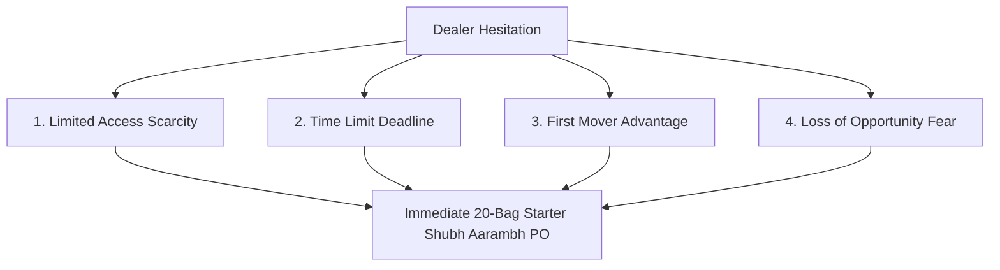

# Dan Kennedy Urgency & Direct Response Decision Trigger SOP
## Swatch Paints — Sales & Negotiations Division Standard Operating Procedure (v2.0)

---

### 📌 Document Details
- **Author**: Dan Kennedy (Dealer Activation Specialist & Direct Response Architect)
- **Division**: Sales & Negotiations Division
- **Collaborating Legends**: Brian Tracy (CSO), Jordan Belfort (Closing Funnel), Jeremy Miner (NEPQ), Neil Rackham (SPIN), Alex Hormozi (Offer Architect), Chris Voss (Tactical Empathy)
- **Target Audience**: Field Sales Executives, Area Sales Managers, Independent Wholesale Distributors
- **Territory**: Rajasthan (Bundi Base/HQ, Kota Expansion Hub, Hadoti Regional Centers)
- **Operation Mode**: 24*7 On-Demand Autonomous Guidance for Field Representatives
- **Status**: Registered for CEO Ashutosh Sharma Signoff (`PENDING_CEO_APPROVAL`)

---

## 1. Executive Purpose & Strategic Context

In business-to-business retail sales, **the single greatest killer of deals is not competitor strength or high price — it is dealer procrastination**.

Dealers default to:
- *“Soch ke batata hoon”*
- *“Agle mahine aana”*
- *“Market dekh ke batayenge”*

When a salesman responds with *"Theek hai sir"*, the deal evaporates into thin air.

**The Dan Kennedy Urgency Engine trains field representatives to inject ethical, authentic, undeniable tension into the buying decision**:
- Delay must have a visible, painful cost.
- Immediate action must have a tangible, exclusive reward.

> *“If there is no urgency, there is no sale.”*  
> *“No urgency $\to$ No decision. No decision $\to$ No sale.”*  
> *“The goal of direct response is not to educate — it is to compel immediate action.”*

---

## 2. Integration in the Master 6-Legend Funnel

```text
1. Jordan Belfort    ──► 4-Second Hook & Certainty
2. Jeremy Miner      ──► NEPQ Curious Questioning (60% Listening)
3. Neil Rackham      ──► SPIN ₹17,500/mo Financial Pain Monetization
4. Alex Hormozi      ──► 7-Layer No-Brainer Offer Stack
5. Dan Kennedy       ──► URGENCY & DIRECT RESPONSE TRIGGER (Right Now)
6. Chris Voss        ──► Tactical Empathy & Margin Protection (No Discounts)
```

---

## 3. The 4 Urgency Creation Pillars



### Pillar 1: Limited Access (Ethical Scarcity)
- **Principle**: People value what is scarce, exclusive, and difficult to acquire. Never appear like you have endless bags to dump on every street corner.
- **Field Script**:
  > *“Sir hum Kota/Bundi market me har kisi ko Swatch texture nahi de rahe. Hum select territory me sirf 8–10 counters ko master distribution support de rahe hain, jisme se 6 counters already book ho chuke hain. Isliye ye introductory slot zyada din open nahi rahega.”*

### Pillar 2: Real Time Limit (Concrete Deadlines)
- **Principle**: Deadlines force priority. Without a deadline, every decision is postponed indefinitely.
- **Field Script**:
  > *“Sir ye 20-bag trial par 1 bag FREE ka Shubh Aarambh bonus company launch allocation ke tahet strictly is Sunday shaam 6:00 baje tak valid hai. Monday se regular price apply hogi.”*

### Pillar 3: First Mover Advantage (Monopoly Territory Rights)
- **Principle**: The first dealer in a neighborhood gets to own the painters before competitors even know the product exists.
- **Field Script**:
  > *“Sir jo pehle enter karta hai, wahi area ke thekedaron ko ₹50 cash tokens ke zariye apni dukan par lock kar leta hai. Baad me aane walo ko competition se fight karni padti hai.”*

### Pillar 4: Loss of Opportunity (Loss Aversion)
- **Principle**: Behavioral economics proves that human beings hate losing ₹1,000 twice as much as they enjoy gaining ₹1,000.
- **Field Script**:
  > *“Sir agar aaj decide nahi kiya, toh do nuksan honge: Pehla, har mahine ₹17,500 ka extra margin bleed hota rahega; doosra, ho sakta hai kal ye territory slot aapke samne wale counter ko chala jaye.”*

---

## 4. Word-for-Word Real-Time Field Execution Playbooks

---

### 🎯 Playbook 1: Dealer bolta hai “Soch ke bataunga”
- ❌ **Amateur Rep**: *“Theek hai sir, bata dena.”*
- ✅ **Dan Kennedy Response**:  
  > *“Sir honestly bolu toh hum iss area me sirf 8–10 dealers le rahe hain, aur 6 already onboard ho chuke hain. Main chahta hoon ki ye territory benefit aapko mile, lekin main is 1-bag free launch slot ko zyada time tak hold nahi kar paunga. Kya sirf 20 bag se check karke slot secure karna sensible rahega?”*

---

### 🎯 Playbook 2: Dealer bolta hai “Thoda time do”
- ❌ **Amateur Rep**: *“Kitna time chahiye sir?”*
- ✅ **Dan Kennedy Response**:  
  > *“Sir time lena bilkul sahi hai, bas ek cheez transparently clear kar du: Ye jo 20 bag par 1 bag free aur 7-day 100% exchange guarantee hai, ye sirf factory ke first launch batch ke liye allocated hai. Baad me ye special terms nahi milengi.”*

---

### 🎯 Playbook 3: Dealer bolta hai “Market dekh ke batayenge”
- ❌ **Amateur Rep**: *“Theek hai sir, market dekh lo.”*
- ✅ **Dan Kennedy Response**:  
  > *“Sir market dekhna zaroori hai, lekin jo log market start hone par enter karte hain wohi pure Hadoti ke thekedaron ko control karte hain. Jo wait karte hain, unhe baad me second-choice banna padta hai.”*

---

### 🎯 Playbook 4: Dealer bolta hai “Agle mahine shuru karenge”
- ❌ **Amateur Rep**: *“Agle mahine kab aau sir?”*
- ✅ **Dan Kennedy Response**:  
  > *“Sir agle mahine tak delay karne me problem ye hai ki agle 30 din me aapki dukan se lagbhag 50–60 bag texture nikal jayega. Asian par ₹45 bachega jabki Swatch par ₹400 bachta — matlab 30 din delay karne ka cost seedha ₹17,500 ka cash loss hai. Ek chhota 20-bag trial abhi se start karke is bleed ko rokna behtar nahi hoga?”*

---

## 5. Ethical Compliance & Non-Negotiable Guardrails

1. **Zero Fake Urgency**: Never lie about stock shortages or invent artificial timers like TV teleshopping channels. Use real constraints: factory production batches, territory quotas (max 10 dealers/town), and billing cycle cutoffs.
2. **Maintain Dignity**: Urgency is delivered from a position of authority and calm business expertise, never from a begging or desperate posture.
3. **Always Anchor to the 20-Bag Trial**: The goal of Dan Kennedy urgency is not to push a 500-bag order; it is to trigger immediate commitment for the **20-bag Shubh Aarambh starter trial**.

---

## 6. Daily Field Execution Quota
- **10 Dealers / Day**: Apply direct response urgency to close open discussions.
- **5 Dealers / Day**: Anchor ethical scarcity (limited territory slots).
- **3 Dealers / Day**: Close on firm Sunday 6 PM deadlines.
