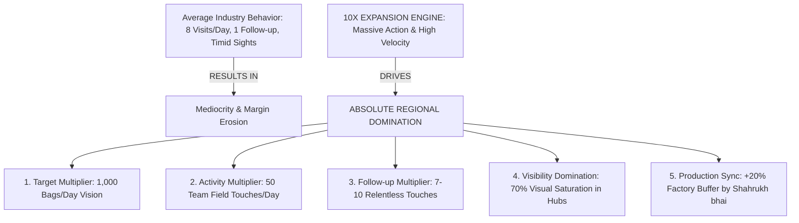

# Grant Cardone 10X Expansion & Market Domination SOP
## Swatch Paints — Sales & Negotiations Division Master Operating Procedure (v2.0)

---

### 📌 Document Details
- **Legend & Author**: Grant Cardone (Growth Multiplier & 10X Expansion Architect)
- **Division**: Sales & Negotiations Division (Pool: `div_sales`)
- **Division Lead**: Brian Tracy (Chief Sales Officer)
- **Collaborating Legends**: Chet Holmes (Dream 100 Strategy), Jeb Blount (Bulk Prospecting), Alex Hormozi (Offer Architect), Jordan Belfort (Straight Line Closer), Joe Girard (Relationship Manager & Retention), Taiichi Ohno (Operations & TPS Production Sync)
- **Target Audience**: CEO Ashutosh Sharma, Executive Leadership, Territory Expansion Managers, Field Sales Force, Independent Distributor Sonu Kumar
- **Territory**: Rajasthan Core Corridor (Bundi HQ, Kota Industrial & Commercial Hub, Hadoti Regional Centers)
- **Status**: Registered for CEO Ashutosh Sharma Signoff (`PENDING_CEO_APPROVAL`)

---

## 1. Executive Purpose & Strategic Mandate

Most paint manufacturing ventures stagnate because they operate on timid targets and linear activity. They hire one field executive, make 6 to 8 shop visits per day, drop off a paper brochure, and wait weeks for dealers to call back. When sales are slow, they reduce their targets, slash prices, and blame market conditions.

**Grant Cardone’s 10X Expansion SOP completely repudiates linear thinking through Massive, Unapologetic Action and Unignorable Market Presence**:
- **“Average actions bring average results. Massive action creates domination.”**
- **“Small action $\longrightarrow$ Small growth. Massive action $\longrightarrow$ Market domination.”**
- **“Competition smart nahi hota, bas consistent hota hai. Tumko unse 10X consistent aur 10X visible hona hai.”**
- **“Never reduce a target; increase your action.”**
- **The Core Law**: To dominate the coatings market across Rajasthan, Swatch Paints must operate at **10X the target vision, 10X the activity volume, 10X the follow-up frequency, and 10X the market visibility** of any competitor.



---

## 2. The 10X Action Framework (5 Core Pillars)

### 🟡 1️⃣ TARGET MULTIPLIER (Think 10X, Act 10X)
- Standard mindset sets conservative targets: *“Chalo aaj 100 bori bechne ka try karte hain ($₹69,000$ billing).”*
- The Cardone standard mandates: **Target 1,000 bags/day ($₹6,90,000$ billing across territory).**
- *The Mathematical Law of 10X*: If you aim for 100 bags and achieve 70%, you sell 70 bags (failure). If you aim for 1,000 bags and achieve 60%, you sell 600 bags (dominant triumph that crushes competition).

---

### 🟢 2️⃣ ACTIVITY MULTIPLIER (Massive Field Movement)
- Average reps make 8–10 shop visits and return home satisfied.
- The 10X field discipline requires **50 team field touches daily** (retail counters, active construction sites, architectural studios, thekedar meetings, and distributor check-ins).

---

### 🔵 3️⃣ FOLLOW-UP MULTIPLIER (Relentless Persistence)
- 48% of sales reps never follow up after the first visit. 25% stop after the second visit.
- **Cardone Rule: A single follow-up is an admission of failure.**
- Minimum **7 to 10 value-added touchpoints** per prospect across multiple channels (in-person drops, cured sample panels, WhatsApp video case studies, technical demo patches, profit comparison sheets) until the customer buys or explicitly opts out.

---

### 🟣 4️⃣ VISIBILITY DOMINATION (The 70% Saturation Rule)
- Obscurity is a company’s greatest enemy. If the market doesn't know you, they cannot buy from you.
- Achieve **70% visual saturation** in designated town commercial centers:
  1. Front high-street shop boards with dealer co-branding.
  2. 1ft x 1ft cured quartz texture display boards on active sales counters.
  3. Swatch sample jars filled with washed natural silica quartz aggregates.
  4. Active under-construction site banners: *“Protected by Swatch 5-Year Weatherguard & Natural Quartz.”*
  5. Branded painter caps, trowels, and T-shirts on job sites.
- **Market Perception Goal**: The market must say: *“Swatch har jagah dikh raha hai — isko ignore karna namumkin hai.”*

---

### 🔴 5️⃣ SPEED EXECUTION (Velocity Beats Perfection)
- Fast quotations, instant sample board handovers, same-day site visits with Senior Chemist Shahrukh bhai, and guaranteed 24-hour factory dispatches from Bundi.
- When an order is booked before 2:00 PM, loading begins immediately under Warehouse Helper Om Prakash Saini for same-day or next-morning site arrival.

---

## 3. Production Alignment System (Zero Stockouts Guarantee)

Massive aggressive sales without manufacturing and warehouse alignment leads to stockouts, delayed trucks, frustrated thekedars, and brand damage. Cardone mandates strict operational synchronization between Sales and the Factory:

```mermaid
graph LR
    F[Sales Demand Forecast: 1,000 Bags] --> P[Production Planning: 1,200 Bags (+20% Buffer)]
    P --> W[Warehouse Inventory Buffer: 200 Bags Ready]
    W --> D[Zero-Delay 24-Hr Dispatch]
```

### Operational Inventory Protocol:
1. **The +20% Buffer Rule**: Factory production must always run at **120% of forecasted demand**. If sales expects 1,000 bags this week, Senior Chemist Shahrukh bhai schedules production for **1,200 bags**.
2. **Buffer Inventory Safeguard**: Warehouse Helper Om Prakash Saini ensures a permanent minimum buffer of **200 ready-to-dispatch bags of Swatch Rustic (25kg)** and **50 pails of Swatch Weatherguard 20L** on pallets at all times.
3. **Raw Material Staging**: Bundi plant maintains minimum 15 days of pre-graded natural silica quartz, acrylic polymers, and additives to absorb sudden 10X bulk project orders from builders.

---

## 4. Real Field Execution Scenarios & 10X Transmutations

| Business Dimension | Normal Linear Behavior (Average) | Grant Cardone 10X Aggressive Execution |
| :--- | :--- | :--- |
| **Dealer Expansion** | 1 new dealer onboarded per month. | **10 new dealers onboarded per month** across Bundi, Kota, and Hadoti hubs. |
| **Site Penetration** | 2 construction sites visited per week. | **20 active construction sites penetrated per week** with on-site trowel demos. |
| **Market Visibility** | 1 shop flex board installed every 2 months. | **10 high-visibility front boards + 50 sample display panels installed monthly.** |
| **Follow-Up Cadence** | 1 phone call after 10 days (*“Sir kya socha?”*). | **7–10 Multi-touch value strikes** (demo, profit sheet, WhatsApp video, token handoff). |
| **Distributor Growth** | Passive supply waiting for Sonu Kumar to call. | **Active daily order tracking, joint distributor dealer runs, and expansion into 11 city markets.** |

---

## 5. Aggressive Daily, Weekly, and Monthly SOP

### 📅 Daily Aggressive Field Cadence:
- **50 Field Touches**: Distributed across retail dealers, active sites, architects, and thekedars.
- **20 New Leads & Contacts**: Sourced and entered into CRM (`users.csv`).
- **15 Structured Follow-Ups**: Executing touches 3 through 8 for warm prospects.
- **5 Live Closing Attempts**: Presenting Shubh Aarambh starter batches or bulk project slabs.
- **Evening 7:00 PM Audit**: Daily dispatch report compiled for CEO Ashutosh Sharma.

### 📆 Weekly Aggressive Cadence:
- **100+ New Contacts** logged into CRM database.
- **50+ Qualified Prospects** meeting John McMahon's MEDDPICC criteria.
- **20+ Commercial Deals Closed** across texture and emulsion lines.
- **Inventory Buffer Audit**: Verify 200+ bags ready buffer in Bundi warehouse with Om Prakash Saini.

### 🗓️ Monthly Aggressive Cadence:
- **200+ Dealer Counter Coverage** across Rajasthan target territories.
- **50+ New Active Recurring Accounts** established.
- **1,000+ Bags/Day Movement Velocity Target** systematically approached.
- **Executive Growth Presentation**: Deliver month-end scale analytics to CEO Ashutosh Sharma.

---

## 6. Strategic Expansion Progression (Dominate Small Area First)

Cardone expansion is aggressive but never reckless. It executes an unstoppable geographic cascade:
$$\mathbf{\text{Phase 1: Bundi HQ Dominance}} \longrightarrow \mathbf{\text{Phase 2: Kota Commercial Saturation}} \longrightarrow \mathbf{\text{Phase 3: Hadoti Regional Corridors}} \longrightarrow \mathbf{\text{Phase 4: Entire Rajasthan Market}}$$

1. **Phase 1: Bundi Base (100% Saturation)**: Lock every major hardware counter, thekedar crew, and local municipal project within Bundi. Zero competitor penetration allowed.
2. **Phase 2: Kota City (Commercial Scale)**: Penetrate the industrial, commercial, and coaching hub. Establish 20 Dream 100 counters and 20 major builder BOQs.
3. **Phase 3: Hadoti Corridors (Network Expansion)**: Expand Sonu Kumar's wholesale distribution into the 11 approved city markets (Talera, Dabi, Bijoliya, Baran, Rawatbhata, Uniyara, Nainwa, Dei, Khatkad, Deoli).
4. **Phase 4: State-Wide Domination**: Replicate the 10X model across Jaipur, Ajmer, Udaipur, and Jodhpur.

---

## 7. What Grant Cardone Will NEVER Do
- ❌ **NEVER accept slow, incremental growth** when massive action can capture the market today.
- ❌ **NEVER play safe or wait for the "perfect timing"** before approaching large builders and dealers.
- ❌ **NEVER stop following up after 1 or 2 attempts** (relentless minimum 7–10 touches).
- ❌ **NEVER discount below authorized dealer billing tiers**.
- ❌ **NEVER use negative trade terminology** (strictly avoid "mandi"; use "B2B Market" or "Retail Trade Network").
- ❌ **NEVER address trade partners disrespectfully** (always use `"[Name] ji"`, never colloquial slang like "Ustaad").

---

## 8. Integration with the Complete Sales & Operations Stack

$$\begin{aligned}
\text{John McMahon} &\longrightarrow \text{Strict Qualification (Filter out time-wasters)} \\
\text{Chet Holmes} &\longrightarrow \text{Dream 100 Selection (Focus on top 100 whales)} \\
\text{Jeb Blount} &\longrightarrow \text{Bulk Prospecting (Architects, builders, thekedars)} \\
\text{SPIN \& NEPQ} &\longrightarrow \text{Deep Diagnostic Problem Discovery} \\
\text{Keenan} &\longrightarrow \text{Gap Economics \& Financial Loss Quantification} \\
\text{Alex Hormozi} &\longrightarrow \text{Irresistible Grand Slam Offers \& Risk Reversal} \\
\text{Chris Voss} &\longrightarrow \text{Tactical Empathy \& Price Protection} \\
\text{Jordan Belfort} &\longrightarrow \text{Straight Line Closing with Absolute Certainty} \\
\text{Joe Girard} &\longrightarrow \text{7-Day Payment Discipline \& Lifelong Retention} \\
\mathbf{\text{Grant Cardone}} &\longrightarrow \mathbf{\text{10X MULTIPLIER: Scale Activity, Speed, Visibility \& Volume Across Everything!}} \\
\text{Taiichi Ohno \& Shahrukh} &\longrightarrow \text{Synchronized +20\% Factory Buffer Production (Zero Stockouts)}
\end{aligned}$$
