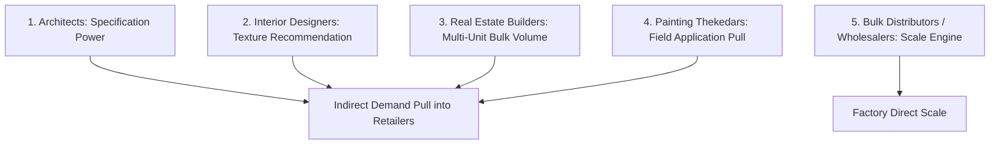
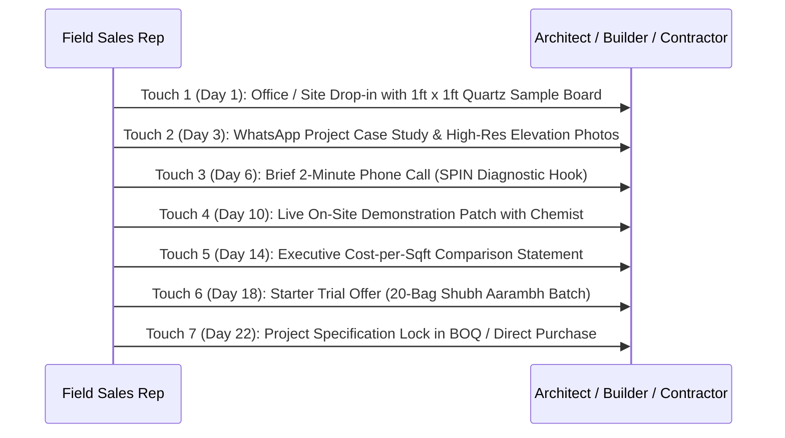

# Jeb Blount Bulk Network Prospecting SOP
## Swatch Paints — Sales & Negotiations Division Standard Operating Procedure (v2.0)

---

### 📌 Document Details
- **Author**: Jeb Blount (Prospecting Architect & Pipeline Engine)
- **Division**: Sales & Negotiations Division
- **Collaborating Legends**: John McMahon (Target Qualification), Neil Rackham (SPIN Diagnosis), Jeremy Miner (NEPQ Questioning), Jordan Belfort (Straight Line Closer), Joe Girard (Relationship Manager), David Ogilvy (Branding)
- **Target Audience**: Field Sales Executives, Institutional Territory Managers, Independent Distributor (Sonu Kumar)
- **Territory**: Rajasthan (Bundi HQ, Kota Industrial & Commercial Hub, Hadoti Regional Centers)
- **Status**: Registered for CEO Ashutosh Sharma Signoff (`PENDING_CEO_APPROVAL`)

---

## 1. Executive Purpose & Strategic Mandate

Most manufacturing sales forces fail because they limit their prospecting exclusively to retail shop counters. If a company only pitches retail dealers, the dealer always complains: *“Maal ki market me demand nahi hai, jab koi maangne aayega tab rakhunga.”*

**Jeb Blount’s Prospecting SOP engineers an unstoppable "Indirect Demand Pull" into the market**:
- **“The sale doesn’t start at closing… it starts with the RIGHT prospect.”**
- **“No pipeline $\to$ No sales. No network $\to$ No growth.”**
- **“Sales battlefield me jeetne se pehle, tumhe battlefield banana padta hai.”**
- Systematically prospect **Architects, Interior Designers, Real Estate Builders, and Large Painting Contractors**.
- When the architect specifies Swatch in the project BOQ (Bill of Quantities) and the builder/contractor walks into the local hardware store demanding 100 bags of Swatch Rustic, **the retail dealer has zero choice but to stock and pay for Swatch**.

---

## 2. The 5 High-Value Target Segments

---

### 🟡 1. ARCHITECTS & SPECIFIERS (The Design Gatekeepers)
- **Commercial Leverage**: 1 Architect specifies a texture on 5 commercial buildings $\implies$ 2,500 bags of guaranteed texture pull.
- **Office Drop-in Protocol**: Never arrive empty-handed. Always carry the **Swatch Architectural Texture Box** (1ft x 1ft real quartz demo board + cured samples of Swatch Rustic and Roller Coat).
- **Opening Script**:  
  > *“Namaste [Architect Name] ji! Main Swatch Paints se hoon. Hum Bundi me natural silica quartz se textured coatings manufacture karte hain. Hum dekhte hain ki modern elevations me architects artificial plastic finish ki jagah natural earthy stone texture pasand kar rahe hain. Aap jo current projects design kar rahe hain, usme aapke liye sabse badi priority kya rehti hai — zero-fading UV stability ya customized quartz granule thickness?”*

---

### 🟢 2. INTERIOR DESIGNERS (The Aesthetic Influencers)
- **Commercial Leverage**: Recommends interior accent walls, cafe interiors, luxury villas, and boutique retail showrooms.
- **Studio Drop-in Protocol**: Present sample panels showcasing Swatch Rustic Texture and Swatch Shine Emulsion.
- **Opening Script**:  
  > *“Namaste [Designer Name] ji! Clients hamesha living room feature walls aur exterior balconies me tactile, premium feel dhoondhte hain. Swatch ka rustic texture zero-gloss natural quartz aggregate deta hai jo standard paint se 10x zyada premium dikhta hai. Kya hum aapke sample library ke liye 2 physical demo panels drop kar sakte hain?”*

---

### 🔵 3. THEKEDARS & PAINTING CONTRACTORS (The Field Labor Generals)
- **Commercial Leverage**: Directly purchases 50–200 bags/month; controls trowel application speed and labor efficiency.
- **Site Visit Protocol**: Visit under-construction sites between 10:00 AM and 2:00 PM while work is active. Inspect trowel glide.
- **Opening Script**:  
  > *“Namaste [Contractor Name] ji! Aapke is site ka elevation kaam bahut badhiya chal raha hai. Ek cheez puchni thi — abhi jo texture aap chala rahe ho, usme dhoop me setting jaldi aane se trowel par heavy load padta hai ya batch me dana alag nikalta hai? Shahrukh bhai ne Bundi plant me 100% graded quartz aggregate se Swatch Rustic banaya hai jo makkhan ki tarah chalta hai, plus har 25kg bori ke andar ₹50 ka instant cash token card rehta hai jo seedha aapke karigar ka fayda karta hai.”*

---

### 🟣 4. REAL ESTATE BUILDERS & DEVELOPERS (Bulk Volume Drivers)
- **Commercial Leverage**: Purchases 500 to 2,000 bags per project phase; hyper-sensitive to total landed square-foot cost and warranty assurance.
- **Boardroom Protocol**: Present a cold, comparative **Sqft Cost-Benefit Sheet** contrasting Swatch landed rate vs MNC landed rate.
- **Opening Script**:  
  > *“Namaste [Builder Name] ji! Aapke upcoming multi-unit residential project me square-foot coating cost control sabse bada challenge hai ya MNC brand certification ke sath durable 5-year weather protection? Swatch direct factory dispatch se landed sqft cost par 30% saving deliver karta hai jisse aapka per-unit margin substantially improve hota hai, with zero compromise on quartz durability.”*

---

### 🔴 5. BULK WHOLESALERS & DISTRIBUTORS (The Scale Engine)
- **Commercial Leverage**: Moves 200–500 bags/month across town networks; cash liquidity conscious.
- **Governance**: Governed under the independent distributor framework (e.g. Sonu Kumar @ ₹430/bag wholesale transfer rate, 200 bags/month committed volume).
- **Opening Script**:  
  > *“Namaste [Distributor Name] ji! Aapke town me MNC brands par 3–4% margin milta hai aur payment mahino atka rehta hai. Swatch independent distributor ko direct ₹430/bag factory rate par dispatch deta hai, jisme town ke sub-dealers ko 40% margin pass karne ke baad bhi distributor ka solid profit bachta hai. Kya hum aapke territory me exclusive wholesale distribution terms review karein?”*

---

## 3. The 5–7 Touch Multi-Channel Prospecting Cadence

Fanatical Prospecting dictates: **1 touch produces zero sales; 80% of B2B project conversions happen between the 5th and 7th touchpoint.**

---

## 4. The Referral Flywheel (Never Leave a Meeting Empty-Handed)

Every interaction must yield new pipeline leads:
1. **From Every Retail Dealer**: Request names and phone numbers of the **top 3 painting contractors** who buy the most texture in their area.
2. **From Every Thekedar**: Ask for references of **2 fellow contractors or ongoing construction sites** in nearby colonies.
3. **From Every Architect**: Inquire which **builders and general contractors** are currently executing their active facade blueprints.

> **Referral Script**:  
> *“Sharma ji, aapke circle me aise kaun se 2 thekedar ya builders hain jo is waqt bada elevation project kar rahe hain aur jinko natural quartz texture se cost aur quality dono me bada fayda ho sakta hai?”*

---

## 5. Daily, Weekly, and Monthly Prospecting SOP

### 📅 Daily Cadence (The Fanatical Routine):
- **10 Active Site Visits**: Stop at active residential and commercial building construction sites.
- **5 Architect / Interior Designer Studio Meets**: Drop off physical texture sample kits.
- **5 Contractor Interactions**: Hand over ₹50 token cards and demonstrate quartz trowel glide.
- **3 Wholesale Distributor Connects**: Review town territory expansion and wholesale margins.
- **10 New Verified B2B Contacts**: Log verified phone numbers and site addresses into CRM (`users.csv`).

### 📆 Weekly Cadence:
- Follow up on **20 Warm Prospects** in Touches 3 to 5.
- Conduct **10 On-Site Demo Patches** with local thekedars.
- Advance **5 Serious Large Accounts** into commercial price slab negotiations.

### 🗓️ Monthly Cadence:
- Add **50+ New High-Value B2B Contacts** across Kota, Bundi, and Hadoti corridors.
- Convert a minimum of **10 New Accounts** into active recurring purchasers.
