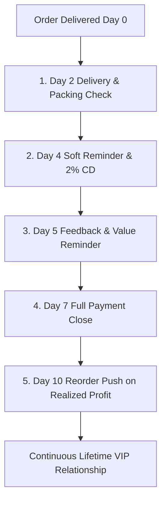

# Joe Girard Relationship Manager & Retention Payment SOP
## Swatch Paints — Sales & Negotiations Division Standard Operating Procedure (v2.0)

---

### 📌 Document Details
- **Author**: Joe Girard (Relationship Manager & Retention Architect)
- **Division**: Sales & Negotiations Division
- **Collaborating Legends**: Brian Tracy (CSO), Zig Ziglar (Trust Engine), Alex Hormozi (Offer Architect), Chris Voss (Tactical Empathy), Warren Buffett (CFO)
- **Target Audience**: Field Relationship Managers, Territory Sales Managers, Independent Distributor (Sonu Kumar)
- **Territory**: Rajasthan (Bundi Base/HQ, Kota Expansion Hub, Hadoti Regional Centers)
- **Status**: Registered for CEO Ashutosh Sharma Signoff (`PENDING_CEO_APPROVAL`)

---

## 1. Executive Purpose & Strategic Mandate

In the paint manufacturing industry, **acquiring a new dealer costs 5x more than retaining an existing one**. A company that focuses solely on the first sale burns capital and exhausts territory goodwill.

**Joe Girard's Relationship Management SOP transforms Swatch Paints from a transactional supplier into an indispensable, beloved business partner**:
- **First Sale = Business Start. Repeat Sale = Real Business.**
- Protect dealer **Lifetime Value (LTV)** by engineering regular re-orders.
- Enforce **strict 7-day payment discipline** with zero rudeness, friction, or relationship damage.

> *“People don’t buy once… They buy from people they LIKE, TRUST, and REMEMBER.”*  
> *“If you sell something, you make a customer today. If you help someone and stay connected, you make a customer for life.”*

---

## 2. The Law of 250 in Regional Paint Retail

Every hardware and paint dealer in Hadoti sits at the center of an interconnected web of approximately **250 individuals**:
- 80 to 120 Painting Thekedars and Karigars
- 40 to 60 Local Building Contractors and Masons
- 30 to 50 Fellow Retailers in Local Trade Associations
- Architects, Engineers, and High-Net-Worth Homeowners

$$\text{Delighted Dealer} \implies \mathbf{+250\text{ Positive Advocates}} \implies \text{Organic Flywheel Growth}$$
$$\text{Offended Dealer} \implies \mathbf{-250\text{ Poisoned Wells}} \implies \text{Territory Burnout}$$

**Field Mandate**: Every interaction with a dealer must protect and elevate this network.

---

## 3. The 5-Step Relationship & Retention Cadence

### Step 1: Personal Connect & Name Memorization
- Greet owners and their counter helpers by their actual registered names: **`[Dealer Name] ji`**.
- Keep record of shop staff names (e.g. Ramesh the billing boy, Mukesh the warehouse loader).
- *“Namaste Sharma ji! Kaise ho? Mukesh bhai kahan hain aajkal? Last batch ka movement kaisa raha?”*

### Step 2: Regular Touchpoint System
- Never go silent after an order. Maintain 1–2 weekly physical visits and 1 polite mid-week WhatsApp check-in.
- *“Sir bas check kar raha tha counter par stock kaisa chal raha hai, koi thekedar demo ya sample board ki zaroorat toh nahi?”*

### Step 3: Post-Sale Follow-up Sequence
- **Day 2**: Call to confirm safe transport delivery and bag integrity.
- **Day 5**: Check painter response on trowel glide and quartz aggregate consistency.
- **Day 10**: Reorder trigger based on bags sold and margin pocketed.

### Step 4: Logical Reorder Trigger (Remind the Realized Cash)
- Never ask for an order like a beggar (*“Sir order kab de rahe ho?”*).
- Frame the reorder around the **profit they already banked**:
  > *“Namaste [Dealer Name] ji! Pichle 10 din me counter se 30 bag texture dispatch ho chuka hai, jisse lagbhag ₹12,000 ka clean profit generate hua. Counter par stock zero na ho aur painters dusri dukan par na jayein, isiliye kya Monday subah ke liye same 30 bag ka batch schedule kar dein?”*

### Step 5: Respectful 7-Day Payment Discipline Cadence
Credit is strictly capped at 7 days. Collection must be executed with firm institutional discipline and courteous personal warmth.

| Timeline | Channel | Objective | Standard Script |
| :--- | :--- | :--- | :--- |
| **Day 0** | Physical / Invoice | Delivery Confirmation | Invoice generated clearly stating 7-day payment window & 2% CD for 5-day settlement. |
| **Day 4** | WhatsApp / Call | Soft Friendly Reminder | *“Namaste [Name] ji! Bas ek friendly update — invoice INV-104 ka 2% Cash Discount slot kal sham close ho raha hai. Agar aap clear kar sakein toh ₹690 seedha aapka bachta hai.”* |
| **Day 5** | Call | Value & CD Reminder | *“Sir payment process ho jayega toh accounts me clear mark ho jayega aur next order me priority delivery aur scheme benefits active rahenge.”* |
| **Day 7** | Personal Visit / Call | Firm Institutional Close | *“Sir invoice aaj 7 days cycle par complete ho raha hai. Accounts system ke mutabiq ise close kar dete hain taaki agla order smoothly dispatch ho sake aur koi block na lage.”* |

---

## 4. Grounded Field Scenarios & Word-for-Word Dialogues

---

### 🎯 SCENARIO 1: Dealer Is Procrastinating on Re-Ordering
- ❌ **Wrong (Begging)**: *“Sir please agla order de do na, target atka hua hai.”*
- ✅ **Joe Girard Approach (Profit Reminder)**:  
  > *“Namaste [Dealer Name] ji! Last month aapne 40 bags Swatch Rustic bechkar seedha ₹16,000 ka clean cash margin kamaya. Asian par 40 bag bechne par sirf ₹1,800 milta. Agar aap is cycle ko uninterrupted continue rakhein, toh dukan ka poora electricity bill aur ek helper ki salary akele Swatch nikal deta hai. Kya next 40 bags ka dispatch kal schedule karein?”*

---

### 🎯 SCENARIO 2: Payment Is Delayed Past Day 7
- ❌ **Wrong (Aggressive/Offensive)**: *“Sir aap payment kyu nahi kar rahe? Mal wapas le jaunga.”*
- ✅ **Joe Girard Approach (System Constraint & Relationship Protection)**:  
  > *“Namaste [Dealer Name] ji! Main jaanta hoon aap counter par busy rehte hain. Lekin company ki audit policy ke mutabiq 7-day cycle par payment clear hona zaroori hota hai taaki factory se agla dispatch automatically approve ho sake. Hum dono ka commercial relation ekdum smooth rahe, isiliye kya hum ise aaj sham tak UPI ya cheque se close kar lein?”*

---

### 🎯 SCENARIO 3: Dealer Appears To Lose Interest
- ❌ **Wrong (Ignoring the Dealer)**: Shift to another shop and stop visiting.
- ✅ **Joe Girard Approach (Extreme Ownership & Investigation)**:  
  > *“Sharma ji, mujhe aisa feel hua ki pichle kuch din me counter par Swatch ki movement thodi slow hui hai. Kya painters ko finish me koi issue aaya, ya margin calculation me koi confusion hai? Jo bhi concern ho aap openly batao — main Shahrukh bhai (Senior Chemist) ko sath lekar site par demo karwa dunga. Hamara rishta sirf maal bechne ka nahi hai, isko solve karna meri personal responsibility hai.”*

---

## 5. Daily, Weekly, and Monthly Operational Cadence

### 📅 Daily Quota for Relationship Managers:
- **10 In-Person Dealer Counter Visits** (Focus on personal warmth, staff greetings).
- **5 Existing Dealer Follow-Ups** (Post-sale checks on Days 2, 5, or 10).
- **3 Payment Collection Touchpoints** (Days 4, 5, or 7).
- **2 Pure Goodwill Calls** (Zero selling; checking on family, health, or market pulse).

### 📆 Weekly Cadence:
- Visit **Top 5 VIP Dealerships** (Review quarterly DGP volume toward 300 bags/month).
- Conduct **1 In-Person Thekedar / Painter Tea Meeting** at a prominent retail counter.

### 🗓️ Monthly Cadence:
- Compile Dealer Retention Rate (Target: $\ge 70\%$ active monthly re-orders).
- Host "Top Counter Partner of the Month" memento presentation.
