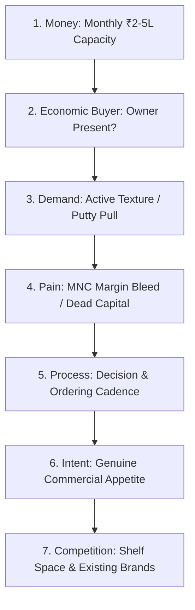

# John McMahon Target Dealer Qualification SOP
## Swatch Paints — Sales & Negotiations Division Standard Operating Procedure (v2.0)

---

### 📌 Document Details
- **Author**: John McMahon (Target Selection Engine & Qualification Architect)
- **Division**: Sales & Negotiations Division
- **Collaborating Legends**: Jeb Blount (Prospecting Engine), Neil Rackham (SPIN Diagnosis), Alex Hormozi (Offer Architect), Joe Girard (Relationship Manager), Warren Buffett (CFO)
- **Target Audience**: Field Sales Executives, Territory Managers, Independent Distributor (Sonu Kumar)
- **Territory**: Rajasthan (Bundi HQ, Kota, Talera, Dabi, Bijoliya, Baran, Rawatbhata, Nainwa, Deoli, Uniyara)
- **Status**: Registered for CEO Ashutosh Sharma Signoff (`PENDING_CEO_APPROVAL`)

---

## 1. Executive Purpose & Strategic Mandate

The greatest single waste of capital and sales force energy in manufacturing is chasing the wrong retail accounts. Field sales representatives often spend days drinking tea at low-volume, credit-hungry counters that never produce repeat business and ultimately default on payments.

**John McMahon’s Qualification SOP institutes an unforgiving, mathematical target selection engine**:
- **“Not every customer is worth your time.”**
- **“Right customer $\to$ Easy sale. Wrong customer $\to$ Constant struggle.”**
- **“Growth fast tab hoti hai jab tum wrong logon ko 'NO' bolte ho.”**
- Protect company working capital by filtering out chronic credit-seekers before a single bag leaves the plant.
- Focus 100% of sales enablement and sample resources on **financially solvent, high-turnover counters**.

---

## 2. The Simplified MEDDPICC System for Regional Paint Trade

Adapted from John McMahon's enterprise qualification framework to fit regional Indian hardware and paint retail dynamics:



### 🟡 1. M — MONEY (Counter Financial Capacity)
- **Diagnostic Objective**: Determine if the counter has the purchasing power and liquidity to move 30–50 bags/month without needing company credit financing.
- **Field Question**:  
  *“Sir counter par monthly paint, primer aur putty ka approximate turnover kitna nikal jata hai?”*
- **Qualification Criteria**:
  - **Ideal (2 pts)**: Monthly paint billing between ₹2,00,000 and ₹5,00,000; healthy working capital.
  - **Marginal (1 pt)**: ₹1,00,000 to ₹2,00,000 monthly turnover.
  - **Disqualified (0 pts)**: Less than ₹50,000 monthly billing; struggling for daily liquidity.

### 🟢 2. E — ECONOMIC BUYER (Decision Power)
- **Diagnostic Objective**: Identify who actually controls purchasing checks and product additions.
- **Field Question**:  
  *“Namaste sir! Naye coating products aur factory brand agencies ka final decision aap khud lete hain ya koi partner/elder family member involve hote hain?”*
- **Qualification Criteria**:
  - **Ideal (2 pts)**: Owner is seated on the counter, actively engaged, and has sole decision-making authority.
  - **Disqualified (0 pts)**: Salesman pitches to a shop helper or employee who has zero commercial power.

### 🔵 3. D — DEMAND (Texture & Exterior Co-requisite)
- **Diagnostic Objective**: Verify if the counter has painters and thekedars who actively buy texture and exterior coatings.
- **Field Question**:  
  *“Sir aapke counter se mahine me lagbhag kitni boriyaan rustic texture, roller coat ya exterior putty thekedar utha lete hain?”*
- **Qualification Criteria**:
  - **Ideal (2 pts)**: Existing demand of $\ge 30\text{ bags/month}$; 10+ active painting contractors visiting weekly.
  - **Marginal (1 pt)**: 10–20 bags/month demand.
  - **Disqualified (0 pts)**: Zero exterior coating demand (only selling screws, pipes, or sanitaryware).

### 🟣 4. P — PAIN (Monetizable Frustration)
- **Diagnostic Objective**: Uncover economic dissatisfaction with current multinational paint brands.
- **Field Question**:  
  *“Sir market me MNC brands par 3–4% margin milta hai aur ₹3–4 lakh machine me block rehta hai — kya is margin se counter par real profit bach pata hai?”*
- **Qualification Criteria**:
  - **Ideal (1 pt)**: Dealer actively expresses anger over low margin, predatory sales quotas, or locked tinting machine capital.
  - **Disqualified (0 pts)**: Dealer is completely content with 3% MNC margins and fears corporate brand loss.

### 🔴 5. P — PROCESS (Buying & Onboarding Protocol)
- **Diagnostic Objective**: Understand how the dealer tests and adopts a new product.
- **Field Question**:  
  *“Sir jab koi naya quality brand introduce hota hai, toh aap pehle 20 bags ka small trial batch chala kar painters ka review dekhte hain ya direct bulk lete hain?”*
- **Qualification Criteria**:
  - **Ideal (1 pt)**: Open to a standard 20-bag Shubh Aarambh starter trial with cash settlement.
  - **Disqualified (0 pts)**: Demands 90-day consignment stock or free goods before testing.

### 🟤 6. I — INTENT (Buying Velocity vs Curiosity)
- **Diagnostic Objective**: Distinguish serious commercial buyers from casual time-pass conversationalists.
- **Behavioral Signals**:
  - **High Intent (2 pts)**: Asks for dealer price slabs, calculates net margin per bag, inspects texture demo board quartz granules, asks about delivery turnaround from Bundi HQ.
  - **Low Intent (0 pts)**: Refuses to disclose current figures, checks watch repeatedly, deflects to *"agla saal dekhenge"*.

### ⚫ 7. C — COMPETITION (Market Vulnerability)
- **Diagnostic Objective**: Assess which legacy brands dominate their shelves and where service gaps exist.
- **Field Question**:  
  *“Sir abhi counter par Asian ya Berger ka stock delivery kitne din me aata hai, aur kya transit me bag damage ka issue rehta hai?”*
- **Qualification Criteria**:
  - **Ideal (1 pt)**: Mixed multi-brand counter experiencing distributor delivery delays or minimum order pressures.

---

## 3. The 10-Point Qualification Scorecard

Every field representative must fill this 10-point scorecard on their mobile before scheduling a formal closing pitch:

| Category | Factor | Max Pts | Scoring Rubric |
| :---: | :--- | :---: | :--- |
| **M** | **Monthly Money Capacity** | **2** | $\ge ₹2\text{L}$ billing = **2** \| ₹1–2L = **1** \| $< ₹1\text{L}$ = **0** |
| **E** | **Economic Buyer Present** | **2** | Owner present & negotiating = **2** \| Helper/Proxy = **0** |
| **D** | **Active Texture Demand** | **2** | $\ge 30\text{ bags/month}$ pull = **2** \| 10–20 bags = **1** \| Zero = **0** |
| **P** | **MNC Margin Pain** | **1** | Vocally frustrated with 3% margin = **1** \| Complacent = **0** |
| **I** | **Commercial Intent Signals** | **2** | Active pricing scrutiny & trial openness = **2** \| Evasive = **0** |
| **C** | **Payment Capacity & Terms** | **1** | Clean payment record, accepts 7-day terms = **1** \| Demands 45-day credit = **0** |
| **TOTAL** | | **10** | **Sum of all 6 Dimensions** |

### 🎯 Scorecard Decision Gates:

```text
┌─────────────────┬─────────────────┬────────────────────────────────────────────────────────┐
│ Total Score     │ Classification  │ Action Required                                        │
├─────────────────┼─────────────────┼────────────────────────────────────────────────────────┤
│ 8 – 10 Points   │ 🟢 HIGH TARGET  │ Top Priority! Execute immediate field closing & trial. │
│ 5 – 7 Points    │ 🟡 MEDIUM / NUR │ Place in nurture sequence; provide 1 sample board.     │
│ Below 5 Points  │ 🔴 DISQUALIFY   │ AVOID! Do not visit again. Zero sales hours invested. │
└─────────────────┴─────────────────┴────────────────────────────────────────────────────────┘
```

---

## 4. Real Field Scenarios & Diagnostic Decisions

---

### 🎯 SCENARIO 1: The Small Rural Hardware Shop
- **Field Data**:
  - Total turnover: ₹40,000/month (nails, PVC fittings, 2 buckets of local distemper).
  - No active painting contractors.
  - Owner demands: *“10 bori daal do, bikne ke 2 mahine baad paisa denge.”*
- **Scorecard**:
  - Money: 0 | Economic Buyer: 2 | Demand: 0 | Pain: 1 | Intent: 0 | Payment: 0 $\implies$ **Total: 3 / 10**
- **McMahon Directive**:  
  ❌ **RUTHLESSLY DISQUALIFY**. Zero bags dispatched. Never finance slow-moving stock on credit.

---

### 🎯 SCENARIO 2: The High-Volume Mixed Building Materials Counter
- **Field Data**:
  - Total turnover: ₹3,50,000/month in paint, cement, and sanitary.
  - 15 regular painting contractors visiting daily for exterior project materials.
  - Owner seated on counter; actively complains that Asian Paints gives him only 3.5% margin while locking ₹3.5 Lakh in tinting machines.
  - Asks: *“Bundi se Kota kitni der me dispatch aa jata hai? Aur bag par margin kitna chhodte ho?”*
- **Scorecard**:
  - Money: 2 | Economic Buyer: 2 | Demand: 2 | Pain: 1 | Intent: 2 | Payment: 1 $\implies$ **Total: 10 / 10**
- **McMahon Directive**:  
  ✅ **TIER-1 PRIORITY TARGET**. Deploy Alex Hormozi Shubh Aarambh starter trial immediately.

---

### 🎯 SCENARIO 3: The Massive Exclusive MNC Paint Showroom
- **Field Data**:
  - Total turnover: ₹12,00,000/month.
  - Fully branded exclusive showroom with 3 automated tinting machines.
  - Owner is locked into multinational annual overseas travel bonuses and volume rebates.
  - Politely says: *“Hum sirf branded MNC maal bechte hain, local brands counter par allow nahi karte.”*
- **Scorecard**:
  - Money: 2 | Economic Buyer: 2 | Demand: 2 | Pain: 0 | Intent: 0 | Payment: 0 $\implies$ **Total: 6 / 10**
- **McMahon Directive**:  
  ⚠️ **DREAM 100 LIST ONLY**. Do not burn daily sales bandwidth attempting to pitch. Revisit quarterly when MNC margins tighten further.

---

## 5. Ideal Customer Profile (ICP) for Swatch Paints

A qualified Swatch Paints counter meets **all 6 baseline criteria**:

1. **Category**: Mixed Hardware + Paint + Building Material Retail Counter (high-traffic commercial markets).
2. **Monthly Paint Billing**: ₹2,00,000 to ₹5,00,000 across putty, primer, and coatings.
3. **Trade Mindset**: Commercially astute, entrepreneurially aggressive; values cash profit over corporate TV ads.
4. **Painter Ecosystem**: Minimum 10 regular painting thekedars buying texture bags weekly.
5. **Ownership Structure**: Owner-operator directly involved on the billing counter.
6. **Payment Discipline**: Capable of settling invoices within 7 days to pocket the 2% Cash Discount.

---

## 6. Daily, Weekly, and Monthly Qualification SOP

### 📅 Daily Cadence for Sales Force:
- **Phase 1 (Search & Map)**: Identify **20 new potential retail shops** in target market territory.
- **Phase 2 (Qualify)**: Apply the 7 MEDDPICC diagnostic questions to **10 shops** via counter visit or phone.
- **Phase 3 (Shortlist)**: Score each shop; select only the **top 5 high-scoring counters** ($\ge 8\text{ pts}$).
- **Phase 4 (Closing Pitch)**: Attempt **2 on-site trial closes** (20-bag Shubh Aarambh trial) exclusively with high-scoring counters.

### 📆 Weekly Cadence:
- Review territory qualification log with CSO Brian Tracy.
- Purge any counter scoring below 5 from active calling lists.
- Allocate sample boards exclusively to verified Tier-1 targets.

### 🗓️ Monthly Cadence:
- Analyze conversion rate of qualified counters vs disqualified leads.
- Update territorial Dream 100 target lists for Kota, Bundi, and Hadoti growth corridors.
