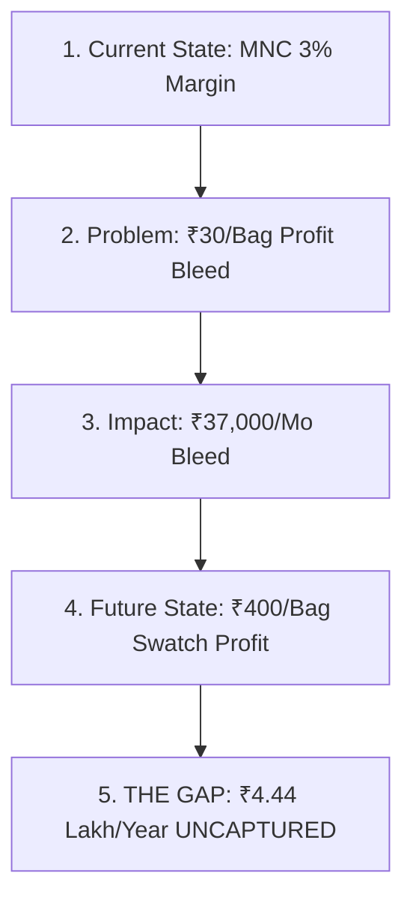

# Keenan Gap Selling & Financial Loss Calculator SOP
## Swatch Paints — Sales & Negotiations Division Standard Operating Procedure (v2.0)

---

### 📌 Document Details
- **Author**: Keenan (Gap Selling Architect & Financial Reality Builder)
- **Division**: Sales & Negotiations Division
- **Collaborating Legends**: Neil Rackham (SPIN Diagnosis), Jeremy Miner (NEPQ Questioning), Jordan Belfort (Straight Line Closer), Dan Kennedy (Urgency Trigger), Alex Hormozi (Offer Architect), Warren Buffett (CFO)
- **Target Audience**: Field Sales Executives, Territory Managers, Independent Distributor (Sonu Kumar)
- **Territory**: Rajasthan (Bundi Base/HQ, Kota, Hadoti Regional Belt)
- **Status**: Registered for CEO Ashutosh Sharma Signoff (`PENDING_CEO_APPROVAL`)

---

## 1. Executive Purpose & Strategic Mandate

Most sales representatives fail because they attempt to sell **benefits and positive features** (*“Hamara paint durable hai, quality achhi hai, margin zyada hai”*). Human psychology does not make difficult business decisions to gain an abstract benefit; **human beings act aggressively to stop an active, painful, bleeding financial loss**.

**Keenan’s Gap Selling SOP institutes an unforgiving financial reality engine**:
- **“People don’t buy because of benefits… They buy to fix a costly problem.”**
- **“No Pain $\to$ No Sale. No Loss $\to$ No Urgency.”**
- **“Log profit ke liye nahi, active loss ko rokne ke liye decision lete hain.”**
- Strip away every vague marketing adjective (*“best product”*, *“accha margin”*).
- Replace vague pitches with **cold, undeniable rupee arithmetic calculated right before the dealer's eyes**.

---

## 2. The 5-Stage Gap Model in Regional Paint Retail

### Stage 1: Current State (Aaj Ki Asliyat)
- Discover current reality: What brands are on the shelf? What is the actual realized margin per bag? What is the monthly sales volume?
- **Diagnostic Question**:  
  *“Namaste [Dealer Name] ji! Counter par abhi monthly lagbhag kitne bags texture nikalte hain aur ek bag par net in-hand margin kitna bachta hai?”*

### Stage 2: Problem Identification (Root Cause of Bleed)
- Pinpoint the exact commercial constraint:
  - Multinational paint brand margin is compressed to 3–4% (₹30–₹40 per ₹1,150 bag).
  - Heavy capital locked in automated tinting machines (₹3,00,000 to ₹3,50,000).
  - Slow-moving stock occupying expensive floor space.
- **Diagnostic Question**:  
  *“Sir 100 bag texture bechkar pure mahine me sirf ₹3,000–₹4,000 ka margin bacha — kya is category se dukaan ka ek helper ka kharcha bhi nikal pata hai?”*

### Stage 3: Impact (Financial Bleed & Working Capital Drag)
- Calculate the immediate, recurring collateral damage on the dealer's business:
  - Working capital trapped in low-yielding stock.
  - Electricity and staff overheads subsidized by other hardware items.
- **Diagnostic Question**:  
  *“Sir agar 100 bag par sirf ₹3,500 ban raha hai, jabki dukan ka floor space aur helper ka load texture par barabar lagta hai, toh monthly kitna net shortfall generate ho raha hai?”*

### Stage 4: Future State (Ideal Destination)
- Establish the desired financial destination: 40% margin, zero tinting machine capital lock, fast factory replenishment from nearby Bundi HQ.
- **Diagnostic Question**:  
  *“Sir agar yahi 100 bag Swatch Rustic Texture me move hone lagein, jahan dealer margin ₹400 per bag seedha aapki jeb me bachta hai, toh counter ki monthly income par kya farq padega?”*

### Stage 5: The GAP (The Buying Catalyst)
- Calculate the exact mathematical delta between Current State and Future State:
$$\mathbf{\text{Monthly GAP (Active Loss)}} = \mathbf{(100\text{ Bags} \times ₹400) - (100\text{ Bags} \times ₹30) = ₹40,000 - ₹3,000 = ₹37,000\text{ / Month}}$$
$$\mathbf{\text{12-Month Compounded Hemorrhage}} = \mathbf{₹37,000 \times 12 = ₹4,44,000\text{ / Year}}$$

> **Keenan Climax Script**:  
> *“Sir, aap har mahine dukan se ₹37,000 aur har saal ₹4,44,000 ka cash MNC company ke account me chhod rahe ho. Yahi paisa agar aapki dukan me rukta, toh dukan ka poora saal ka light bill, 2 helpers ki annual salary aur ek nayi commercial delivery van ka EMI akele Swatch texture se nikal jata!”*

---

## 3. The Cold Arithmetic Loss Formulas

Every field sales executive must memorize and execute these 4 financial formulas:

$$\begin{aligned}
\text{1. Margin Loss per Bag} &= \text{Swatch Dealer Margin (₹400)} - \text{MNC Dealer Margin (₹30)} = \mathbf{₹370\text{ / Bag}} \\
\text{2. Monthly Category Hemorrhage} &= \text{Monthly Volume (e.g. 50 Bags)} \times ₹370 = \mathbf{₹18,500\text{ / Month}} \\
\text{3. Annual Cost of Inaction} &= \text{Monthly Loss} \times 12 = \mathbf{₹2,22,000\text{ / Year}} \\
\text{4. Tinting Machine Opportunity Cost} &= \frac{₹3,50,000\text{ Locked Machine Capital}}{₹13,800\text{ (20-Bag Swatch Batch)}} = \mathbf{25\text{ Inventory Turns Lost}}
\end{aligned}$$

---

## 4. Script Refinement System (Vague Fluff $\to$ Hard Rupee Numbers)

Keenan forbids sales reps from speaking like typical salesmen. Here is the mandatory script transformation table:

| # | Typical Amateur Sales Pitch (Banned) | Keenan Refined Script (Mandatory) | Psychological Driver |
| :-: | :--- | :--- | :--- |
| **1** | *“Sir hamara product best hai aur margin bahut achha milega.”* | *“Sir abhi aap 100 bag par ₹3,000 kama rahe ho; Swatch par seedha ₹40,000 banta hai. Difference ₹370 per bag ka hai. Har mahine ₹37,000 counter se bleed ho raha hai.”* | Specific Rupee Delta vs Vague Hype |
| **2** | *“Sir machine mat lagwao, usme nuksan hota hai.”* | *“Sir ₹3.5 lakh machine aur base paste me block karke 2.5% return milta hai. Wahi ₹3.5 lakh Swatch fast-moving texture me lage toh saal me 6 baar ghoomkar ₹84,000 net cash profit dega.”* | Capital Velocity vs Dead Capital |
| **3** | *“Sir try karke dekho, koi problem nahi aayegi.”* | *“Sir 20 bag ka small Shubh Aarambh starter batch try karne me ₹13,800 lagta hai jisme ₹8,000 net profit banta hai aur 7-day 100% money back exchange likhit me rehta hai. Zero risk, instant cash.”* | Quantified Risk Reversal |
| **4** | *“Sir thekedar ko hamara texture pasand aayega.”* | *“Sir har 25kg bori ke andar ₹50 ka direct cash token rehta hai jo painter ki jeb me jata hai, plus thekedar ko 1ft x 1ft ka real quartz demo board milta hai jisse site approval aadhi der me ho jata hai.”* | Painter Economics & Trowel Glide |
| **5** | *“Sir jaldi decide karo offer khatam ho jayega.”* | *“Sir har din jo aap decision delay karte ho, counter se ₹1,230 ka clean profit Asian ki jeb me chala jata hai. Sunday 6:00 PM tak agar 20-bag trial lock karte hain toh ye bleed turant stop ho jata hai.”* | Daily Bleed Cost (Time Multiplier) |

---

## 5. Grounded Rajasthan Field Scenarios

---

### 🎯 SCENARIO 1: The 100-Bag High-Volume Dealer
- **Field Context**: Dealer moves 100 bags of MNC exterior texture per month in Kota City.
- **Current State**: 100 bags $\times$ ₹30 margin = **₹3,000 monthly profit**.
- **Future State**: 100 bags $\times$ ₹400 Swatch margin = **₹40,000 monthly profit**.
- **The GAP**: **₹37,000/month** ($\implies$ **₹4,44,000/year**).
- **Keenan Dialogue**:  
  > *“Namaste Sharma ji! Main aapse ye nahi kehne aaya ki Swatch Asian se badi company hai. Main sirf aapka calculator lene aaya hoon. 100 bag par Asian aapko ₹3,000 deta hai; Swatch ₹40,000 deta hai. Har 30 din me aap ₹37,000 ka nuksan seh rahe ho. Saal ka ₹4.44 Lakh! Kya aap agle saal bhi Asian ko apne bacchon ki school fees jitna profit daan me dena chahte ho, ya ye bleed aaj stop karein?”*

---

### 🎯 SCENARIO 2: The Tinting Machine Capital Trap
- **Field Context**: Dealer has ₹3.5 Lakh blocked in computerized tinting machine + colorant canister inventory.
- **Current State**: Machine yields 2.5% net margin after maintenance, power, and tube drying losses.
- **The Opportunity Cost**: ₹3,50,000 deployed in ready-to-apply Swatch quartz bags (zero machine, zero paste drying).
- **Keenan Dialogue**:  
  > *“Gupta ji, ₹3.5 Lakh machine me block karke aapko mahine ka ₹8,000 net return milta hai. Agar yahi capital Swatch ke 25kg ready bags me rotation par lag jaye, toh saal me 6 turnover cycles me ₹84,000 ka net cash banata hai — zero maintenance, zero colorant dry-up loss. Machine dukan ki shaan badhati hai, lekin Swatch dukan ka bank balance badhata hai!”*

---

### 🎯 SCENARIO 3: The Slow-Moving MNC Stock Hemorrhage
- **Field Context**: Dealer has ₹80,000 of slow-moving specialty exterior paint occupying premium shelf space for 90 days.
- **The Bleed**: Working capital locked at 0% return; inflation and interest cost = ₹4,000.
- **Keenan Dialogue**:  
  > *“Sir ₹80,000 ka stock 90 din se dukan par dhool kha raha hai. Agar wahi space aur capital Swatch Rustic Texture ke 20 bags trial me laga hota, toh pichle 90 din me 6 baar ghoom chuka hota aur counter par ₹48,000 ka clean profit generate kar chuka hota. Dead stock rakhna dukan ke cash flow par direct attack hai.”*

---

## 6. Daily, Weekly, and Monthly Operational Cadence

### 📅 Daily Quota for Field Sales Executives:
- **10 Dealer Gap Calculations**: Open calculator in front of 10 prospective counters.
- **5 Exact Monthly Loss Presentations**: Voice the exact rupee bleed to 5 qualified dealers.
- **3 Annual Hemorrhage Closures**: Project the 12-month compounded loss (e.g. ₹2.22L–₹4.44L) to 3 high-volume counters.

### 📆 Weekly Cadence:
- Formulate personalized **Dealer Profit Gap Statements** for the top 10 territory targets.
- Refine rep pitch recordings: ruthlessly strip any adjective and replace with numbers.

### 🗓️ Monthly Cadence:
- Publish real territory case studies of dealers who switched to Swatch and recaptured ₹30,000+/month.
