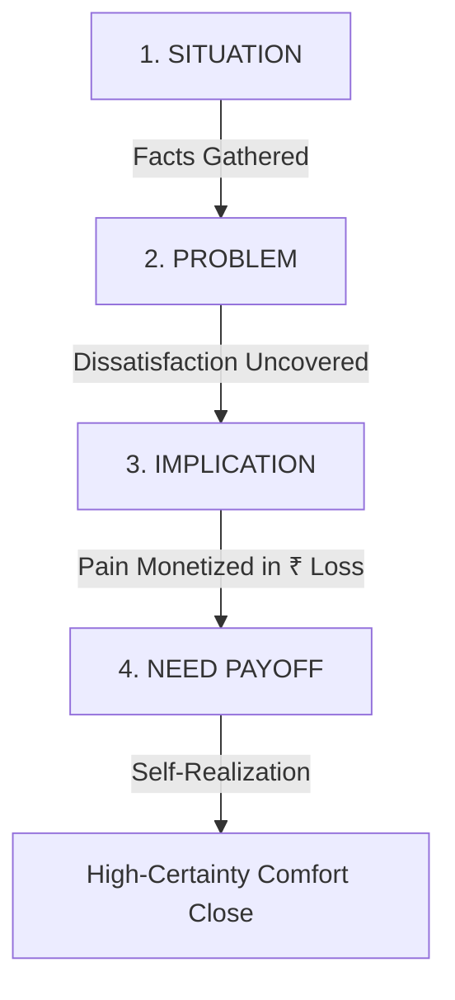

# Neil Rackham SPIN Selling & Deep Pain Monetization SOP
## Swatch Paints — Sales & Negotiations Division Standard Operating Procedure (v2.0)

---

### 📌 Document Details
- **Author**: Neil Rackham (SPIN Selling Specialist & Deep Diagnosis Expert)
- **Division**: Sales & Negotiations Division
- **Collaborating Legends**: Jordan Belfort, Jeremy Miner, Alex Hormozi, Brian Tracy
- **Target Audience**: Field Sales Executives, Territory Sales Managers, Wholesale Distributors
- **Territory**: Rajasthan (Bundi Base/HQ, Kota Expansion Hub, Hadoti City Markets)
- **Status**: Registered for CEO Ashutosh Sharma Signoff (`PENDING_CEO_APPROVAL`)

---

## 1. Executive Purpose & Context
Conventional paint salesmen jump directly to product features ("Sir hamara texture 25kg bag me aata hai aur finish bahut acchi hai"). This triggers immediate psychological sales resistance and price bargaining.

The **Neil Rackham SPIN SOP** trains field reps to diagnose before prescribing. By guiding the dealer through **Situation $\to$ Problem $\to$ Implication $\to$ Need Payoff**, the dealer themselves articulates that continuing with current low-margin brands is costing them lakhs of rupees every year.

---

## 2. The 4-Stage SPIN Diagnosis Funnel

### Stage 1: Situation Questions (Facts & Baselines)
- **Objective**: Establish counter profile, current brand velocity, and baseline unit economics.
- **Tone**: Curious, respectful, non-threatening business peer.
- **Key Questions**:
  1. *"Namaste [Dealer Name] ji, counter par abhi texture coatings me kaunsa brand primary chal raha hai?"*
  2. *"Average mahine ka kitna bag dispatch ho jata hai projects aur retail me?"*
  3. *"Current brand par counter ko per bag gross margin kitna bachta hai?"*
- **Field Limit**: Maximum 3 situation questions. Do not interrogate.

### Stage 2: Problem Questions (Uncovering Dissatisfaction)
- **Objective**: Gently guide the dealer to express frustration with margin, capital rotation, and painter loyalty.
- **Key Questions**:
  1. *"Sir jo ₹40–₹50 margin mil raha hai, usme dukan ka overhead aur credit risk nikalne ke baad kuch solid bachta hai ya sirf transaction rotate ho raha hai?"*
  2. *"Texture season me stock kabhi godown me atka hai jisme working capital block ho gaya ho?"*
  3. *"Painter ko company se koi direct incentive na milne ki wajah se kya wo saste alternative ki demand karta hai?"*

### Stage 3: Implication Questions (Quantifying the Bleed in ₹)
- **Objective**: Multiply the single transaction problem across 12 months and demonstrate severe financial loss.
- **The Core Calculation**:
  - Legacy margin: ₹50 / bag on 50 bags = **₹2,500 monthly profit**
  - Swatch margin: ₹400 / bag on 50 bags = **₹20,000 monthly profit**
  - **Net Lost Opportunity**: **₹17,500 / month = ₹2,10,000 / year**
- **Key Questions**:
  1. *"Sir agar har mahine 50 bag par aap sirf ₹2,500 kama rahe ho jabki potential ₹20,000 ka hai, toh kya aap notice kar rahe ho ki counter se har mahine ₹17,500 ka seedha loss ho raha hai?"*
  2. *"Agar saal bhar ka hisaab lagayein, toh ₹2,10,000 ka profit jo aapke bank account me hona chahiye tha, wo legacy brand ke TV ad budget me chala gaya. Is loss ka aapke business growth par kya effect pad raha hai?"*
  3. *"Jab ₹2 lakh inventory slow ho jaati hai, toh cash flow tight hone par suppliers ko time par pay karne me difficulty aati hai na?"*

### Stage 4: Need Payoff Questions (The Dealer Closes Themselves)
- **Objective**: Have the dealer verbalize how Swatch solves their working capital and margin crisis.
- **Key Questions**:
  1. *"Sir agar texture bag par ₹400 ka clean margin mile aur har bag me ₹50 ka liquid cash coupon painter ke liye ho, toh counter ka profit kitna jump karega?"*
  2. *"Agar stock fast move ho aur company 7-day payment par 2% extra cash discount de, toh working capital rotation kitni easy ho jayegi?"*
  3. *"Toh sir, kya is ₹17,500 ke monthly bleed ko rokne ke liye ek small 20-bag Shubh Aarambh starter trial start karna sensible aur comfortable rahega?"*

---

## 3. Grounded Field Scenarios Matrix

| Scenario Type | Situation | Problem | Implication (₹ Loss) | Need Payoff |
| :--- | :--- | :--- | :--- | :--- |
| **Kota Multi-Brand Retailer** | 80 bags/mo Asian/Berger texture | Margin capped at ₹45/bag (Total: ₹3,600/mo) | Bleeding ₹28,400/month (₹3,40,800/yr) compared to Swatch ₹400 margin | 20-bag trial unlocks ₹8,000 instant margin and reclaims lost cash flow |
| **Bundi Mixed Hardware Counter** | 30 bags/mo unbranded/local putty | Quality complaints, painter rejection, zero repeat | 10 lost contractors = ₹1,50,000 lost paint business across whole year | Swatch Rustic ₹50 painter cash token creates instant painter pull |
| **Baran Commercial Site Dealer** | Damp wall site requiring 50 bags | Standard putty fails in monsoons; dealer bears replacement blame | Customer cancels entire paint contract; ₹75,000 site loss | Swatch Weatherguard + Waterproofing guarantee eliminates site risk |
| **Bijoliya Marble Belt Counter** | 40 bags/mo premium stone finish | Premium finish gives low dealer cut; giant brands dictate price | ₹14,000/mo margin gap while carrying heavy inventory credit risk | Dedicated Swatch experience sample board + ₹460 margin gives independence |

---

## 4. Operational Rules for Sales Reps
1. **Never Give the Number First**: Always ask the dealer their current numbers. Once the dealer says *"50 bag"* and *"₹50 margin"*, the ₹17,500 loss calculation becomes undeniable fact.
2. **Never Argue or Criticize Competitors**: Do not say Asian Paints is bad. Say: *"Asian brand pull ke liye theek hai sir, lekin dukan ka kharcha nikalne ke liye aapko high-margin product chahiye."*
3. **Always Anchor to the 20-Bag Starter Trial**: Never ask for 100 bags immediately after diagnosis. Close with low-risk comfort close: *"Sir sirf 20 bag se check karte hain."*
