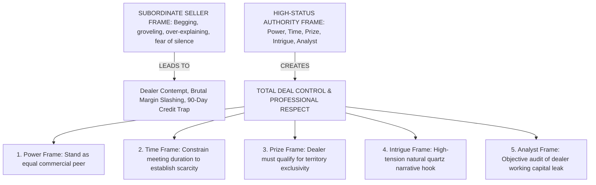
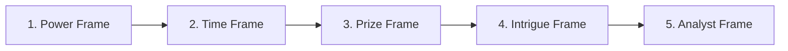

# Oren Klaff Frame Control & Status Elevation Master Standard Operating Procedure
## Swatch Paints — Sales & Negotiations Division Master Operating Procedure (v2.0)

---

### 📌 Document Details
- **Legend & Author**: Oren Klaff (Conversation Controller & Status Elevation Architect)
- **Division**: Sales & Negotiations Division (Pool: `div_sales`)
- **Division Lead**: Brian Tracy (Chief Sales Officer)
- **Collaborating Legends**: April Dunford (Positioning Engine), Chris Voss (Tactical Empathy), Jordan Belfort (Straight Line Closer), Jeremy Miner (NEPQ Questioning), Neil Rackham (SPIN Diagnosis), Alex Hormozi (Offer Architect)
- **Target Audience**: CEO Ashutosh Sharma, Executive Leadership, Territory Sales Managers, Field Sales Executives, Independent Wholesale Distributor Sonu Kumar
- **Territory**: Rajasthan Core Trade Corridor (Bundi HQ, Kota Industrial & Commercial Hub, Hadoti Regional Centers)
- **Status**: Registered for CEO Ashutosh Sharma Signoff (`PENDING_CEO_APPROVAL`)

---

## 1. Executive Purpose & Strategic Mandate

In the Indian building materials and paint trade, the social status hierarchy is heavily tilted in favor of entrenched retail shop owners. Wealthy dealers who have operated for 25 years routinely treat manufacturer sales representatives like desperate, subservient beggars. They make reps wait 45 minutes on plastic stools, continue scrolling through WhatsApp videos while the rep is speaking, demand unearned price cuts, and terminate meetings with a careless wave of the hand.

When a sales rep accepts this low-status posture by saying: *“Sir please apna thoda samay de dijiye, hum nayi company hain, please 10 bori ka order de do,”* **the sale is dead before it starts**.

**Oren Klaff’s Frame Control SOP fundamentally reverses this psychological power dynamic**:
- **“The person who controls the frame… controls the deal.”**
- **“Low status $\longrightarrow$ No respect. No respect $\longrightarrow$ No deal.”**
- **“Dealer pehle product nahi judge karta; pehle tumhe judge karta hai.”**
- **“Never be needy. Neediness is the absolute killer of status and authority.”**
- **“You are not a salesman begging for an order; you are the Prize granting access to territory wealth.”**

---

## 2. The 5 Core Frames Architecture (Pitch Anything)

### 🟡 1. The Power Frame (Neutralizing Dealer Ego & Establishing Parity)
- **Psychological Trigger**: Overcoming the dealer's default assumption that their money makes them superior to the sales rep.
- **Physical Demeanor**: Upright posture, relaxed shoulders, steady eye contact, calm vocal cadence (120–140 words/min), zero fidgeting.
- **Amateur Subservient Behavior**: “Sir aap bade dealer ho, aapki kripa hogi toh hum aage badhenge.”
- **High-Status Power Frame**:
  > *“[Dealer Name] ji, Namaste. Main dekh raha hu aapka counter established hai aur aapka samay kimti hai. Mera samay bhi utna hi kimti hai. Swatch har shahar ke sirf 1 selected counter ke sath exclusive partnership model par kaam karta hai. Isliye pehle hume milkar yeh evaluate karna hoga ki kya aapka business model aur hamara high-margin quartz system aapas me fit hote hain ya nahi.”*

---

### 🟢 2. The Time Frame (Establishing Scarcity of Attention)
- **Psychological Trigger**: Human beings perceive available, unrestricted resources as worthless. Constrained time is instantly perceived as premium.
- **Amateur Subservient Behavior**: “Sir main poora din yahan baith sakta hu, jab aap free ho batana.”
- **High-Status Time Frame**:
  > *“[Dealer Name] ji, mere paas is commercial review ke liye strictly 10 minute hain agle builder meeting se pehle. In 10 minutes me hum yeh dekhenge ki aap bina kisi machine investment ke 40% margin kaise lock kar sakte ho. Agar 10 minute ke baad yeh model aapko practical laga to hum detail me plan banayenge, warna hum aage badh jayenge. Let's look at the numbers.”*

---

### 🔵 3. The Prize Frame (Positioning Swatch as the Scarce Reward)
- **Psychological Trigger**: Flipping the psychological pursuit vector. People desire what is exclusive, guarded, and difficult to obtain.
- **Amateur Subservient Behavior**: “Sir please hamari dealership le lo, hum aapko special gift denge.”
- **High-Status Prize Frame**:
  > *“[Dealer Name] ji, Swatch Rajasthan ke har chowk par board nahi baant raha. Bundi plant har commercial market me sirf 1 dealer ko counter protection deta hai. Sawal yeh nahi hai ki aap Swatch bechna chahte ho ya nahi; sawal yeh hai ki kya aapka counter agle 90 din me 200 bags monthly movement aur prompt 7-day payment discipline ensure karne ki capability rakhta hai.”*

---

### 🟣 4. The Intrigue Frame (Hooking Curiosity & Breaking Boredom)
- **Psychological Trigger**: The dealer's croc brain (the primitive reptilian decision center) filters out boring, routine sales pitches. Novelty and narrative tension force active listening.
- **Amateur Subservient Behavior**: “Sir hamari quality achhi hai aur rates competitive hain.”
- **High-Status Intrigue Frame**:
  > *“[Dealer Name] ji, ek baat bataiye — agar koi aapse kahe ki bina ₹3.5 Lakh ki computerized machine kharide, aap apne counter par har mahine ₹40,000 extra net cash profit generate kar sakte ho with 100% natural silica quartz from Bundi, aur har bag me karigar ke liye ₹50 cash token sealed milega... to kya aap use impossible bologe ya 2 minute nikaal kar sample board dekhoge?”*

---

### 🔴 5. The Analyst Frame (Auditing Working Capital Efficiency)
- **Psychological Trigger**: When dealers attempt to hijack the conversation into emotional arguments or aggressive price demands, shift into the clinical, dispassionate Auditor role.
- **Amateur Subservient Behavior**: “Sir theek hai, aap kitna rate doge batao?”
- **High-Status Analyst Frame**:
  > *“[Dealer Name] ji, pricing par aane se pehle mujhe do numbers analyze karne hain: pehla, aapke showroom me tinting machine aur slow-moving bases me kitna working capital fasa hua hai? Aur doosra, current MNC texture par aapka net margin kitne percent hai? Let's analyze the exact loss before we discuss supply.”*

---

## 3. Real Field Scenarios & Frame Collision Turnarounds

### 🎯 Scenario 1: The Distracted Dealer (Looking at Phone / Ignoring Rep)
- **Dealer Action**: Glancing at mobile, answering personal phone calls while the rep is speaking.
- **Rep Action**: Stop speaking immediately. Sit in calm, comfortable silence. Do not speak until the dealer looks up.
- **Frame Script**:
  > *“[Dealer Name] ji, main dekh raha hu aap calls me busy hain. Main aapse bina poore focus ke baat nahi kar sakta kyunki Swatch ka 40% margin model serious attention demand karta hai. Ya to hum abhi agle 10 minute full focus ke sath yeh review karein, ya main kal 11 baje reschedule kar deta hu. Which works better for you?”*
- **Psychological Result**: The dealer realizes this is not a desperate subordinate. The mobile phone is set aside immediately.

---

### 🎯 Scenario 2: The Aggressive Price Push (*“Discount do warna order nahi milega”*)
- **Dealer Action**: Intimidating tone: *“Market me local texture ₹350 me mil raha hai. Tum ₹600 me do tab baat karenge.”*
- **Rep Action**: Hold physical frame; do not lean forward; do not apologize. Smile calmly.
- **Frame Script**:
  > *“[Dealer Name] ji, discount dena sabse aasan kaam hai, lekin hum wo nahi karte kyunki hum quality aur authorized dealer pricing integrity se compromise nahi karte. ₹350 wala local powder 6 mahine me jhad jata hai aur client payment rokta hai. Swatch 100% washed silica quartz hai. Sawal rate ka nahi hai; sawal yeh hai ki kya aap apne counter par 40% clean profit aur zero customer complaint wala product rakhne me interested ho ya nahi. Agar sirf sasta maal chahiye, to hum fit nahi hain.”*
- **Psychological Result**: The rep exhibits **Walk-Away Power**. The dealer respects the integrity and stops aggressive haggling.

---

### 🎯 Scenario 3: The Big Brand Alpha Defense (*“Main sirf Asian Paints bechta hu”*)
- **Dealer Action**: Arrogant dismissal: *“Hamare yahan sirf Asian Paints chalta hai. Naye brand ki koi zaroorat nahi hai.”*
- **Frame Script**:
  > *“[Dealer Name] ji, Asian Paints aapke showroom ka brand standard hai aur unhe wahan rehna bhi chahiye. Main aapse Asian Paints band karne ko keh hi nahi raha. Wahan aapne ₹3.5L machine block ki hai aur margin 3% milta hai. Swatch unhi smart dealers ke liye design kiya gaya hai jo MNC ke sath-sath apne counter par ek separate **High-Margin Profit Engine** run karte hain jo bina kisi machine ke flat 40% net cash deta hai. Dono products alag-alag purpose serve karte hain.”*
- **Psychological Result**: Eliminates the conflict. Reframes Swatch not as an enemy, but as the counter’s secret profit engine.

---

## 4. Advanced Frame Control Rules for Field Executives

1. **Rule of Neutrality (Never Seek Approval)**:
   - Never say: *“Sir kaisa laga?”*, *“Sir achha laga na?”*, or *“Sir please kuch order bataiye.”*
   - Always say: *“Sir humne numbers dekh liye. Kya yeh commercial model aapke counter ke liye sense banata hai ya hum aage badhein?”*
2. **Control the First 30 Seconds**:
   - The hierarchy of the meeting is established in the first 30 seconds. Do not smile nervously. Give a firm handshake, speak with measured pace, and state the Time Frame immediately.
3. **Never Defend or Over-Explain**:
   - Defending is an admission of low status. When a dealer attacks your product, do not defend; reframe into an audit of their current financial gap.
4. **The Ultimate Power: Willingness to Walk Away**:
   - The person who is willing to walk away from the table without a deal holds absolute power. Never fear walking away from a toxic or unprofitable account.

---

## 5. Daily, Weekly, and Monthly Operational Cadence

### 📅 Daily Frame Control Cadence:
- Execute **10 Power Frame openers** at retail counters.
- Set **5 Time Frames** before meetings begin to eliminate time wasting.
- Enforce **3 Prize Frames** where the dealer must demonstrate volume capacity to win territory exclusivity.
- Log interaction status and frame dominance metrics in CRM (`users.csv`).

### 📆 Weekly Frame Calibration:
- Audit lost deals to detect **Frame Breaks** (instances where reps gave unapproved discounts, groveled, or lost control of meetings).
- Conduct 15-minute live roleplays testing reps on Scenario 1 (Distracted Dealer) and Scenario 2 (Aggressive Price Push).

### 🗓️ Monthly Authority Audit:
- Survey active dealers: Does the trade view Swatch reps as knowledgeable commercial consultants or as pushy salesmen?
- Refine objection turnarounds based on field experiences across Bundi, Kota, and Hadoti corridors.

---

## 6. What Oren Klaff Frame Control Will NEVER Do
- ❌ **NEVER beg, grovel, or plead for orders** under any circumstances.
- ❌ **NEVER offer unapproved price discounts** to appease an aggressive dealer.
- ❌ **NEVER talk continuously out of nervous anxiety** when met with silence.
- ❌ **NEVER accept being ignored or humiliated** by a prospect.
- ❌ **NEVER discount below authorized dealer price slabs**.

---

## 7. Integration with the Full Sales Stack

$$\mathbf{\text{Oren Klaff (Frame Control)}} \longrightarrow \text{April Dunford (Position)} \longrightarrow \text{NEPQ (Questions)} \longrightarrow \text{SPIN (Pain)} \longrightarrow \text{Keenan (Gap)} \longrightarrow \text{Hormozi (Offer)} \longrightarrow \text{Voss (Negotiate)} \longrightarrow \text{Belfort (Close)}$$

1. **Oren Klaff**: Establishes high-status authority and commands the dealer's undivided attention.
2. **April Dunford**: Positions Swatch in an uncontested category (*Zero-Tint Texture Profit System*).
3. **Jeremy Miner (NEPQ)**: Asks disarming questions from a position of authority.
4. **Neil Rackham (SPIN)**: Diagnoses the financial pain of locked working capital and delayed dispatches.
5. **Keenan (Gap Selling)**: Quantifies the cost of inaction and current ₹ margin leakage.
6. **Alex Hormozi**: Presents the Grand Slam risk-free offer.
7. **Chris Voss**: Employs tactical empathy while holding price integrity.
8. **Jordan Belfort**: Closes with absolute certainty in Product, Company, and Rep.
9. **Joe Girard**: Retains the account for life through prompt 7-day payment discipline.
