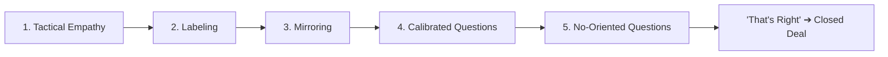

# 📘 SWATCH SKILL FILE — CHRIS VOSS (ADVANCED OBJECTION DOMINATION SYSTEM)
### Dynamic Negotiation Engine — Real-Time Psychological Control
**Governing Executive**: Ashutosh Sharma (CEO & Founder, +91 9079609627)  
**Division**: Sales & Negotiations Division (18 Specialist Legends)  
**Master Legend**: Chris Voss (Former FBI Lead Kidnapping Negotiator & Author of *Never Split the Difference*)  
**Core Directive**: Toughest dealer ko handle karna | Stuck deals revive karna | Bina discount deal close karna | Dealer ko khud decision lene par majboor karna

---

## 🎯 CORE OBJECTIVE

This document defines the field-proven psychological negotiation and objection elimination protocol for Swatch Paints. It arms field sales executives, territory managers, and independent distributors with the exact behavioral techniques needed to dissolve stubborn counter resistance without compromising authorized dealer price slabs or retail margins.

- **Objective 1**: Toughest dealers aur hardware shop owners ke resistance ko scientifically break karna.
- **Objective 2**: Cold, stalled, ya stuck deals ko revive karke active trial orders me convert karna.
- **Objective 3**: Strictly **Bina Discount** ke deal close karna (Zero price cuts, strictly defend authorized dealer price slabs. Protect dealer 40–45% margin against retail MRP. Internal manufacturing costs and internal margins remain strictly confidential executive secrets).
- **Objective 4**: Dealer par pressure dale bina, usko khud decision lene aur Swatch mangwane par majboor karna.

---

## 🧠 CORE PHILOSOPHY

> **“Negotiation = Control through understanding.”**  
> **“Jitna samjhoge, utna jeetoge.”**  
> **“Objection = NO nahi hota… Objection = ‘Samjho mujhe!’”**  
> **“He who controls the emotions… controls the deal.”**

---

## ⚙️ THE 5-PILLAR NEGOTIATION PRINCIPLE SYSTEM



---

### 🟡 1️⃣ TACTICAL EMPATHY (Build Safety & Lower Shields)
Dealer ko feel karvao: *“Ye banda mujhe sun raha hai, meri samasya samajh raha hai, bechne ki jaldi me nahi hai.”*

- **Mechanism**: Acknowledge the dealer’s emotional reality and business pressures before talking about Swatch.
- **Verbatim Verbal Trigger**:  
  > *“Lag raha hai [Name] ji, naye product par risk lene me thoda hesitation feel ho raha hai…”*
- **Operational Result**:
  ✔ Defensive walls drop instantly.  
  ✔ Mutual trust increases because the salesman didn't launch an aggressive rebuttal.

---

### 🟢 2️⃣ LABELING (Emotion Ko Naam Do)
Jo dealer andar feel kar raha hai par bol nahi raha, usko **bol do**.

- **Mechanism**: Use neutral exploratory prefixes (*“Aisa lag raha hai...”, “Aisa lagta hai jaise...”, “Sunne me lag raha hai ki...”*). NEVER say *"Main samajhta hoon"*, because nobody believes that.
- **Verbatim Verbal Trigger**:  
  > *“Lagta hai [Name] ji, aapko doubt hai ki agar stock utha liya to counter se demand aayegi ya nahi…”*
- **Operational Result**:
  ✔ Dealer gets emotional relief.  
  ✔ Dealer starts explaining the real root hesitation freely without defensiveness.

---

### 🔵 3️⃣ MIRRORING (Last 2–3 Words Repeat)
Dealer ke aakhri 2 ya 3 words ko halki curiosity aur upward question pitch ke saath repeat karo.

- **Mechanism**: Do not paraphrase. Repeat the exact words with an inquisitive tone, then stop speaking.
- **Verbatim Ground Example**:  
  > **Dealer**: *“Bhaiya abhi market me is category ki demand nahi hai.”*  
  > **Sales Rep**: *“Demand nahi hai?”* *(Upward inquisitive inflection + 4 seconds pure silence)*  
  > **Dealer**: *“Haan, matlab Asian aur Berger ke alawa thekedar naya naam jaldi nahi maangte, aur agar painter ko pasand nahi aaya to stock phans jayega.”*
- **Operational Result**:
  ✔ Hidden objection automatically surfaces without asking twenty aggressive questions.  
  ✔ Dealer elaborates voluntarily.

---

### 🟣 4️⃣ CALIBRATED QUESTIONS (How & What Questions)
Dealer ko control ka illusion do, jabki conversation ka steering wheel tumhare paas rahe.

- **Mechanism**: Never ask *"Why"* (it creates defensive confrontation: *"Aap naya brand kyu nahi lete?"* makes them feel accused). Only ask *"How"* or *"What"*.
- **Verbatim Ground Examples**:  
  > *“Sir agar painter khud aake maangne lage, to kya aap 20 bag try karoge?”*  
  > *“Sir aisa kya hona chahiye ki aap Swatch ke saath 100% comfortable feel karo?”*  
  > *“Main kaise ensure karoon ki aapka ek bhi bag godown me block na ho?”*
- **Operational Result**:
  ✔ Dealer feels the decision is entirely in his hands.  
  ✔ Dealer designs his own solution.

---

### 🔴 5️⃣ NO-ORIENTED QUESTIONS (Safe Agreement Architecture)
Logon ko *"Yes"* bolne me dar lagta hai (unhe lagta hai wo trap ho rahe hain), lekin *"No"* bolne me unhe safe aur in control feel hota hai.

- **Mechanism**: Frame the question so that saying *"No"* actually means agreeing to move forward with Swatch.
- **Verbatim Ground Examples**:  
  > *“Sir kya aapko lagta hai ki har mahine bina kisi machine ke ₹30,000 extra profit banana galat hoga?”*  
  > *“Sir kya Swatch ka ek chhota 20-bag trial batch godown me rakhna ek bura idea hoga?”*  
  > *“Sir kya aapse is naye direct factory model par 5 minute baat karna aapka time waste karna hoga?”*
- **Operational Result**:
  ✔ Dealer effortlessly responds: *“Nahi, bura idea to nahi hai.”*  
  ✔ Psychological resistance plummets to zero.

---

## 💣 REAL OBJECTION DOMINATION SCENARIOS

---

### 🎯 SCENARIO 1: “Demand nahi hai / Brand naya hai”
- **❌ Normal Sales Rep Mistake**: *“Sir demand to aa jayegi, bohot accha maal hai, ek baar leke dekho.”* (Amateur begging).
- **✅ CHRIS VOSS PROTOCOL**:
  > **Step 1 (Labeling)**: *“Lagta hai [Name] ji, aapko lag raha hai ki naya brand counter par rakh liya to demand nahi aayegi aur capital block ho jayega.”*  
  > **Step 2 (Silence Power)**: *(Wait 4 seconds calmly with Late-Night FM DJ voice)*.  
  > **Step 3 (Calibrated Pivot)**: *“Sir agar ground ke regional painters ko har bag par ₹50 direct cash token aur superior quality mile, to kya wo isko khareedne ke liye aapke counter par demand nahi karenge?”*  
  > **Step 4 (No-Oriented Close)**: *“Kya company ke risk par 20 bag ka sample batch counter par rakhna koi galat decision hoga sir?”*

---

### 🎯 SCENARIO 2: “Price high hai / Saste me do tab lenge”
- **❌ Normal Sales Rep Mistake**: *“Sir thoda discount karwa doon factory se?”* (Fatal margin erosion).
- **✅ CHRIS VOSS PROTOCOL**:
  > **Step 1 (Labeling)**: *“Lagta hai sir aapko pricing structure thoda risky aur competitive nahi lag raha hai.”*  
  > **Step 2 (Silence Power)**: *(Wait 4 seconds. Let them explain what they are comparing it to)*.  
  > **Step 3 (Economic Re-anchor)**: *“Sir kya aap ₹50 saste local maal ke chakkar me counter par painter ki shikayat lena chahoge, ya fir ₹300-₹400 ka pakka net profit banana chahoge?”*  
  > **Step 4 (Calibrated How Question)**: *“Sir main company ki standard high quality polymer formula ko maintain karte hue price kaise kam kar sakta hoon bina quality kharab kiye?”*

---

### 🎯 SCENARIO 3: “Soch ke bataunga / Agle hafte aana”
- **❌ Normal Sales Rep Mistake**: *“Theek hai sir, main agle hafte aata hoon.”* (Dead lead).
- **✅ CHRIS VOSS PROTOCOL**:
  > **Step 1 (Labeling)**: *“Lagta hai sir aap abhi 100% sure nahi ho pa rahe hain aur aapse koi galat commitment na ho jaye.”*  
  > **Step 2 (Silence Power)**: *(Wait for them to nod or sigh)*.  
  > **Step 3 (Calibrated Question)**: *“Sir aisa kya point hai jo abhi aapko rok raha hai ek small 20-bag trial start karne se?”*  
  > **Step 4 (Friction Elimination)**: *“Sir kal subah factory se Hadoti route ki delivery truck nikal rahi hai. Kya 20 bag aapke godown me utarwana bilkul impossible hoga?”*

---

### 🎯 SCENARIO 4: “Hum to already purana established brand hi bechte hain”
- **❌ Normal Sales Rep Mistake**: *“Sir wo brand to margin nahi deta, aap hamara brand try karo.”* (Creates ego clash).
- **✅ CHRIS VOSS PROTOCOL**:
  > **Step 1 (Labeling)**: *“Lagta hai [Name] ji, aap already apne purane brand network ke saath bohot comfortable hain aur naye supplier par time lagana inconvenient lag raha hai.”*  
  > **Step 2 (Mirroring)**: *“Inconvenient lag raha hai?”* *(Gentle upward pitch)*.  
  > **Step 3 (Calibrated Provocation)**: *“Sir agar wahi purane painters aapke counter se texture uthane ke saath-saath har bag par aapko ₹300 extra bachat de jayein, to kya us revenue ko ignore karna counter ke liye sahi hoga?”*  
  > **Step 4 (Close)**: *“Sir purana brand band karne ko koi nahi keh raha, bas ek shelf par Swatch ka direct trial rakh kar dekhte hain.”*

---

## 🔥 ADVANCED PSYCHOLOGICAL CONTROL TECHNIQUES

### ⚡ 1. SILENCE POWER (Dynamic 4-Second Rule)
- Kisi bhi Label, Mirror, ya Question ke baad — **STRICTLY CHUP RAHO**.
- Agar tum pehle bole, to control kho doge. Silence creates psychological pressure; dealer talks to fill the void and reveals their exact bottom line.

### ⚡ 2. LATE-NIGHT FM DJ VOICE
- Deep, calm, slow, down-inflecting tone.
- Eliminates panic, conveys absolute quiet authority, and de-escalates dealer anger or skepticism instantly.

### ⚡ 3. THE “THAT’S RIGHT” MOMENT
- When the dealer says *“Haan, baat to sahi hai”* or *“That’s right”*, their ego defense has surrendered. That is the exact moment to pivot to the 20-bag delivery note.

---

## 📋 SOP & SYSTEM CADENCE

### 🧾 When to Activate Voss Engine
- Jab bhi dealer conversation me stall kare ya excuses de.
- Jab bhi dealer price discount maange.
- Jab bhi rep ko lage ki deal haath se nikal rahi hai.

### 📅 Daily Field SOP
- **Morning Beat Brief**: Review the 4 core Voss objection scripts.
- **Mid-Day Roadblock Coaching**: If stuck on counter, physical rep uses Voss Labeling via WhatsApp audio note or call.
- **Evening Debrief**: Log newly encountered objections into CRM to expand the regional objection matrix.

### 📆 Weekly Review SOP
- Top 5 recurring counter objections analyzed with Brian Tracy & Chris Voss.
- Refined scripts updated and mirrored to all physical field reps.

---

## 🤝 SYSTEM INTEGRATION PIPELINE

```
Belfort (Straight Line Script Start)
  ⬇
NEPQ (Jeremy Miner: Emotion & Problem Open)
  ⬇
SPIN (Neil Rackham: Deep Diagnosis & Financial Bleed)
  ⬇
Voss (Chris Voss: Objection Domination & Tactical Empathy)
  ⬇
Tracy & Belfort (Final Assumptive 20-Bag Trial Close)
```

---

## 🚫 WHAT NOT TO DO (FATAL MISTAKES)

- ❌ **Jaldi bolna**: Never interrupt a dealer who is venting or explaining.
- ❌ **Pressure dalna**: Do not push hard when a dealer hesitates; label the hesitation instead.
- ❌ **Argument karna**: Never debate specs, dealer intelligence, or brand legacy. You can win the argument and lose the sale.
- ❌ **Discount surrendering**: Never offer even a ₹5/bag discount to solve an emotional objection.

---

## 🎯 FINAL PRINCIPLE & GOAL

> **“Objection = NO nahi hota. Objection = ‘Mujhe samjho!’”**  
> **Final Target**: Dealer khud muskura kar bole:  
> *“Theek hai bhai, 20 bag bhej do, trial karke dekhte hain.”*

---
*Governed by Chris Voss (Negotiation Engine) under the sovereign executive authority of CEO Ashutosh Sharma (+91 9079609627).*
