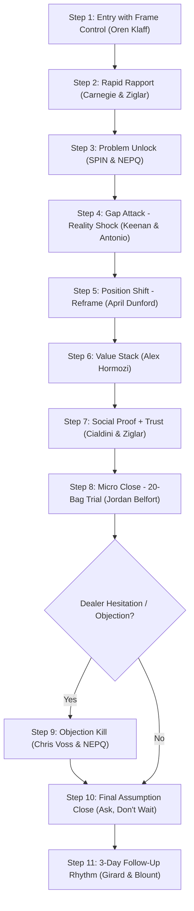

# 📘 SWATCH DEALER ACQUISITION KILLER SCRIPT
### Controlled by Brian Tracy (Chief Sales Officer) — Multi-Legend Closing System
**Governing Executive**: Ashutosh Sharma (CEO & Founder, +91 9079609627)  
**Division**: Sales & Negotiations Division (18 Specialist Legends)  
**Core Directive**: Shop me ghuste hi frame control lena | Dealer mindset shift karna | Profit dikha ke decision force karna | Same visit me trial order close karna

---

## 🎯 EXECUTIVE SUMMARY & OBJECTIVE

This is the official **Dealer Acquisition Killer Script** for all Swatch Paints field sales executives. It replaces generic product pitches with an elite psychological closing system designed to convert skeptical retail counters into committed Swatch dealers on the very first encounter.

- **Primary Mission**: Walk into any retail paint / hardware / building material shop and leave with a signed 20-bag trial order.
- **Core Philosophy**:  
  > *"Product mat becho — Profit becho."*  
  > *"Dealer tab buy karta hai jab usse lagta hai: Ye mujhe paisa kama ke dega."*

---

## 🧠 THE PSYCHOLOGY STACK

| Psychological Trigger | Master Legend | Operational Implementation |
| :--- | :--- | :--- |
| **Scarcity & Authority** | **Oren Klaff** | Position Swatch as selective; we are vetting high-caliber counters, not begging for shelf space. |
| **Rapid Trust & Empathy** | **Dale Carnegie & Zig Ziglar** | Lower defensive shields instantly by asking about *their* business legacy, not pitching paint specs. |
| **Pain Excavation** | **Neil Rackham (SPIN) & Jeremy Miner (NEPQ)** | Probe tinting machine Capex trap, dead inventory, and razor-thin legacy brand margins. |
| **Reality Shock (Gap Selling)** | **Keenan & Victor Antonio** | Contrast ₹3-4 Lakh machine investment earning 3-4% with zero-machine Swatch earning ₹300-400/bag. |
| **Category Reframe** | **April Dunford** | Reframe Swatch: not "just another paint", but a *"Factory-Direct Profit Architecture"*. |
| **Irresistible Value Stack** | **Alex Hormozi** | Stack no Capex, 40-45% dealer margin, painter loyalty tokens (₹50 inside), and guaranteed marketing pull. |
| **Social Proof Acceleration** | **Robert Cialdini** | Cite nearby regional counters already profiting and professional painters demanding Swatch. |
| **Straight Line Micro-Close** | **Jordan Belfort** | Eliminate friction with a low-risk 20-bag trial order. Never ask permission; assume the close. |
| **Tactical Objection Annihilation**| **Chris Voss & Jeremy Miner** | Label hesitations with tactical empathy, neutralize objections in 2 sentences, and pivot directly to delivery. |
| **Follow-Up Discipline** | **Joe Girard & Jeb Blount** | Day 1 Visit ➔ Day 2 Call ➔ Day 3 Pressure + Scheme. Zero leads abandoned. |

---

## 🔥 FULL SCRIPT FLOW (GROUND EXECUTION SYSTEM)



---

### 🟡 STEP 1: ENTRY WITH FRAME CONTROL (Oren Klaff)
**Objective**: Shatter the salesman stereotype within 5 seconds. Establish supreme peer-level authority and commercial curiosity.

> **Verbatim Hindi Script**:  
> *"Namaste [Owner Name] ji, main Bundi factory se Swatch Paints se hoon.  
> Hum abhi pure Hadoti aur regional market me limited high-caliber dealers onboard kar rahe hain.  
> Bas 2 minute me aapse milkar check karna tha ki hamara direct factory distribution model aapke counter ke liye fit baithega ya nahi."*

- **Psychology**: Scarcity + Executive Authority + Non-needy curiosity.
- **Body Language**: Standing tall, calm eye contact, warm confident smile, firm handshake. Never cross arms or lean nervously over the counter.

---

### 🟢 STEP 2: RAPID RAPPORT (Dale Carnegie & Zig Ziglar)
**Objective**: Drop the dealer's guard. People love talking about their hard-earned business success.

> **Verbatim Hindi Script**:  
> *"Sir, aap kitne saalon se is market me paints aur hardware operate kar rahe hain?  
> Aur abhi aapke counter par sabse jyada fast-moving product kaunsa nikal raha hai?"*

- **Goal**: Make the dealer feel respected as a market veteran. Listen actively without interrupting for 45 seconds.

---

### 🔵 STEP 3: PROBLEM UNLOCK (SPIN Selling & NEPQ)
**Objective**: Gently illuminate the hidden financial bleeding in the dealer's existing business.

> **Verbatim Probing Questions**:  
> 1. *"Sir, legacy brands ke texture aur emulsion me actually net margin kitna bachta hai sab kharche nikaal ke?"*  
> 2. *"Tinting machine system lagane ke liye kitna capital block karna pada tha sir — ₹3 se ₹4 Lakh?"*  
> 3. *"Dead inventory ya slow-moving shades ka risk aapko khud jhelna padta hai na?"*

- **Goal**: Bring the dealer to acknowledge: *"Hum mehnat bohot karte hain par legacy brands me margin naam matra ka bachta hai."*

---

### 🟣 STEP 4: GAP ATTACK — REALITY SHOCK (Keenan & Victor Antonio)
**Objective**: Strike directly at the economic disparity with concrete mathematics.

> **Verbatim Hindi Script**:  
> *"Sir simple commercial reality ye hai:  
> Aap ₹3 se ₹4 Lakh machine aur tinting computer me invest karke mushkil se 3% se 4% net margin par kaam kar rahe hain.  
> Aur Swatch Paints me bina kisi machine investment ke, har ek bag par direct ₹300 se ₹400 ka retail margin banta hai.  
> Agar mahine ke 100 bag bhi counter se nikle, to direct ₹30,000 se ₹40,000 ka pure net profit extra generate hota hai."*

- **Psychology**: Reality Shock + Inarguable Unit Economics.

---

### 🔴 STEP 5: POSITION SHIFT (April Dunford)
**Objective**: Detach Swatch from conventional commodity paint comparisons.

> **Verbatim Hindi Script**:  
> *"Sir Swatch sirf ek paint brand nahi hai...  
> Ye aapke counter ke liye ek Factory-Direct High-Margin Profit System hai, jisme middleman ka commission seedha aapke pocket me transfer hota hai."*

- **Goal**: Move from "product category comparison" to "commercial investment model".

---


### ⚫ STEP 6: VALUE STACK (Alex Hormozi — Full Product Ecosystem)
**Objective**: Overwhelm the dealer with irresistible enterprise value across textures, emulsions, and waterproofing.

> **Verbatim Hindi Script**:  
> *"Sir Swatch ke saath aapko complete high-margin product ecosystem milta hai:  
> 1. **Zero Machine Investment** — Na machine khareedni, na computer ka jhanjhat.  
> 2. **Swatch Rustic & Roller Coat** — Har 25kg bori par direct ₹400–₹460 ka wholesale munafa aur painter ke liye ₹50 token.  
> 3. **Swatch Weatherguard & Shine 20L Emulsions** — Har bucket par direct ₹1,640 se ₹1,845 ka net dealer margin (MNC brand me mushkil se ₹150 milta hai sir!).  
> 4. **Swatch Waterproofing & Top Coat** — Roof leakage aur stone protection par seedha 45% margin.  
> 5. **Full Company Pull** — Free 1ft x 1ft display boards aur 15-minute me local customer leads seedha aapke counter par!"*

### ⚡ STEP 7: SOCIAL PROOF + TRUST (Robert Cialdini & Zig Ziglar)
**Objective**: Eliminate isolation anxiety. Prove that the market is already moving towards Swatch.

> **Verbatim Hindi Script**:  
> *"Sir, nearby market ke reputable dealers already Swatch stock kar rahe hain kyunki unka working capital safe rehta hai aur painters ko quality aur cash token dono pasand aa raha hai. Bundi factory se direct material 24–48 ghante me aapke godown me deliver hota hai."*

---

### 💣 STEP 8: MICRO-CLOSE — LOW RESISTANCE TRIAL (Jordan Belfort)
**Objective**: Make saying "yes" ridiculously easy.

> **Verbatim Hindi Script**:  
> *"Sir bada stock lene ki zaroorat bilkul nahi hai.  
> Sirf 20 bag Swatch Rustic ke small trial batch se shuru karte hain.  
> Risk zero hai, material counter par aate hi painters test karenge."*

---

### ⚠️ STEP 9: OBJECTION ANNIHILATION (Chris Voss & Jeremy Miner)

#### Objection 1: “Market me demand nahi hai / Brand naya hai”
> **Verbatim Script**:  
> *"Sir bilkul sahi baat hai, aapka concern 100% genuine hai.  
> Lekin demand create karna factory aur company ki direct responsibility hai hamare ground painter demo programs ke through.  
> Aap sirf supply point baniye taaki jab painter maange to aapka high-margin profit miss na ho."*

#### Objection 2: “Price high hai / Sasta maal chahiye”
> **Verbatim Script**:  
> *"Sir cheap quality maal bechkar counter ki saakh kharab hoti hai aur painter dubara nahi aata.  
> Swatch me ₹50 superior quality polymer formula lagta hai jo deewar par 5 saal tikta hai, aur badle me aap ₹300 extra profit banate hain.  
> Ye mehenga nahi sir, ye business ka sabse smart calculation hai."*

#### Objection 3: “Soch ke bataunga / Agle hafte aao”
> **Verbatim Script**:  
> *"Sir bilkul sochiye, business me soch samajh kar hi aage badhna chahiye.  
> Lekin sochiye kis baat par? Na machine lagani hai, na bada stock lena hai.  
> Sirf 20 bag ka trial batch hai. Aaj entry karwa dete hain taaki kal ki factory dispatch gadi me aapka maal seedha shop par pahuch jaye."*

---

### 🔥 STEP 10: FINAL ASSUMPTION CLOSE (Belfort & Tracy)
**Objective**: Assume the close. Do not ask "Likhun ya nahi?". Write the order calmly.

> **Verbatim Script**:  
> *"Sir 20 bag Swatch Rustic note kar deta hoon. Billing address counter ka hi rahega na sir?  
> Delivery kal subah 11:00 baje tak confirm pahuch jayegi."*

**The Golden Closing Rule**: *After asking the closing statement — SHUT UP. The first person who speaks loses.*

---

## 🔁 3-DAY FANATICAL FOLLOW-UP CADENCE (Joe Girard & Jeb Blount)

| Day | Action | Script / Objective |
| :--- | :--- | :--- |
| **Day 1 (Visit Day)** | Physical Shop Visit | Execute Steps 1 to 10. If closed, log PO immediately in CRM. If unclosed, log exact objections. |
| **Day 2 (WhatsApp / Call)** | High-Value Touchpoint | Send 30-second video of Swatch Rustic sample board application: *"Namaste [Name] ji, kal factory se ye batch dispatch ho raha hai, aapke 20 bag add karwa doon?"* |
| **Day 3 (Decision Call)** | Urgency & Special Scheme | Call dealer: *"Namaste [Name] ji, factory manager ne aaj ke dispatch me sample board free allocate kiya hai. 20 bag confirm kar doon?"* |

---

## 🚫 WHAT NOT TO DO (CRITICAL MISTAKES)

- ❌ **Product feature dumping**: Don't explain viscosity, binder ratios, or chemical formulation unless specifically asked by a chemist.
- ❌ **Price defense without profit context**: Never apologize for price. Always anchor against the ₹300-400 dealer profit margin.
- ❌ **Begging / Desperation**: Never say *"Sir ek baar leke dekho na, please"*. You are an executive offering a high-return partnership.
- ❌ **Leaving without a clear next step**: Always agree on exact delivery date or scheduled follow-up call time.

---

## 📊 SUMMARY SCORECARD & CLOSING CHECKLIST

```
[ ] Step 1: Confident entry, Oren Klaff frame control (Scarcity + Authority)
[ ] Step 2: Rapport built on dealer's business history (Dale Carnegie)
[ ] Step 3: Tinting machine capex & low margin pain unearthed (SPIN / NEPQ)
[ ] Step 4: ₹3-4 Lakh vs ₹300-400/bag profit gap revealed (Keenan / Antonio)
[ ] Step 5: Swatch positioned as Factory-Direct Profit System (April Dunford)
[ ] Step 6: 5-point value stack presented (Alex Hormozi)
[ ] Step 7: Social proof & painter tokens verified (Cialdini / Ziglar)
[ ] Step 8: 20-bag micro-trial order proposed (Jordan Belfort)
[ ] Step 9: Immediate objection handling executed (Chris Voss)
[ ] Step 10: Assumptive close executed with quiet confidence (Brian Tracy)
```

---
*Governed by Brian Tracy (Chief Sales Officer) under the sovereign authority of CEO Ashutosh Sharma (+91 9079609627).*
