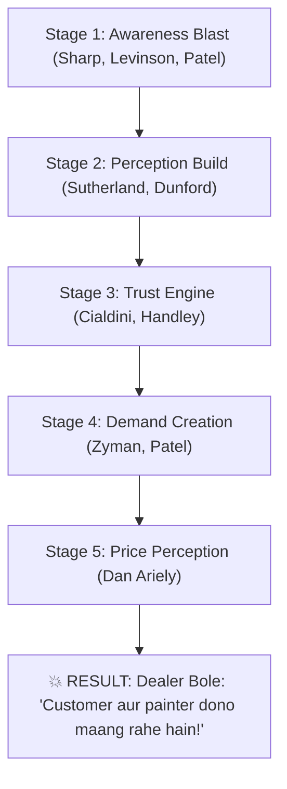

# 🧠 SWATCH PAINTS — MARKETING MIND CONTROL SYSTEM
### Controlled by Philip Kotler (CMO & Marketing Division Commander)
**Governing Executive**: Ashutosh Sharma (CEO & Founder, +91 9079609627)  
**Division**: Core Marketing Strategy & Trade Growth Division (12 Specialist Marketing Legends)  
**Supreme Commander**: Philip Kotler (CMO)  
**Core Mandate**: Pre-influence the market | Architect organic pull demand | Transform Swatch into the "Unavoidable Choice" | Make dealers say *"Customer aur painter dono Swatch maang rahe hain!"*

---

## 🎯 OBJECTIVE & EXECUTIVE SUMMARY

Traditional paint companies waste capital on passive billboards and hope for sales. Swatch Paints executes the **Marketing Mind Control System** — an integrated 5-stage cognitive warfare framework that influences the customer's and dealer's subconscious mind *long before* the sales representative even steps foot into the store.

- **Objective 1**: Pre-wire the dealer's mind so that when the salesman arrives, the dealer has already heard of Swatch.
- **Objective 2**: Create undeniable localized community demand pull so dealers feel genuine FOMO (Fear Of Missing Out).
- **Objective 3**: Cement Swatch as the regional *"Preferred Brand"* across Rajasthan (Bundi HQ, Kota expansion hub, and Hadoti city markets).

---

## 🧠 THE CORE PRINCIPLE

> ### **“Sale hone se pehle decision hota hai.”**  
> *(The purchase decision is made in the customer’s and dealer’s mind days before the money changes hands.)*

---

## 🔥 THE 5-STAGE SYSTEM FLOW



---

### 🟡 STAGE 1: AWARENESS BLAST (Cognitive Saturation)
**Objective**: Shatter invisibility. Ensure every contractor, homeowner, and dealer encounters Swatch at least 3 times within a 7-day window.

#### Tactical Tasks:
1. **Shop Front Saturation**: High-contrast, vibrant Swatch metal display boards, counter stickers, and entry flange boards placed at top retail hardware & paint stores.
2. **Painter Awareness Raids**: Field demonstration teams visiting active residential construction sites in Bundi and Kota, handing out Swatch swatch cards.
3. **Local Digital Geo-Fencing**: Local SEO domination, Google Maps 3-Pack presence, and localized "near me" paint search saturation.

#### Specialist Legend Pool:
- **Byron Sharp** (*Mass Market Scale*): Enforces **Physical & Mental Availability**. Consistent distinctive brand assets (Logo, vibrant orange/slate visual codes, taglines: *"Best Quality. Best Price."*).
- **Jay Conrad Levinson** (*Guerrilla Marketing*): Zero-budget, high-impact localized stunts — 100m branded roadside half-walls and construction scaffolding banners.
- **Neil Patel** (*Local SEO & Digital Capture*): Optimized Google Business Profiles for authorized dealers, ensuring Swatch ranks #1 for *"Texture Paint near me"* and *"Waterproofing Bundi/Kota"*.

---

### 🟢 STAGE 2: PERCEPTION BUILD (Value Architecture & Reframe)
**Objective**: Detach Swatch from low-margin commodity wall putty and cheap distempers. Elevate Swatch into an elite architectural stone texture finish.

#### Tactical Tasks:
1. **Premium Aesthetic Framing**: Packaging that looks modern, robust, and European-grade (clean typography, clear coverage metrics, 5-Year Durability badges).
2. **Category Shift**: Reposition Swatch from "paint" to a *"Factory-Direct High-Performance Quartz Surface System"*.
3. **Demonstration Boards**: Distributing real 1ft x 1ft cured quartz sample boards showing scratch-resistance, weatherproofing, and natural stone sparkle.

#### Specialist Legend Pool:
- **Rory Sutherland** (*Perception Architecture*): Reframes psychological value: *"People don't want a cheaper bucket of paint; they want a wall that never cracks in the Rajasthan summer heat."*
- **April Dunford** (*Radical Positioning*): Isolates Swatch’s unique advantage — zero tinting machine investment for the dealer with direct factory margins.

---

### 🔵 STAGE 3: TRUST ENGINE (Consensus & Verification)
**Objective**: Eliminate skepticism and risk aversion. Homeowners and dealers must see undeniable third-party proof that Swatch works flawlessly on local walls.

#### Tactical Tasks:
1. **Social Proof Walls**: Showcasing completed residential bungalows, commercial showrooms, and temple elevations coated with Swatch Rustic in Hadoti.
2. **Contractor Video Testimonials**: Raw, unscripted 30-second mobile videos of respected local thekedars praising the trowel workability and coverage.
3. **Dealer Trust Signals**: Framing authorized stockist certificates with CEO Ashutosh Sharma’s personal direct quality assurance.

#### Specialist Legend Pool:
- **Robert Cialdini** (*Influence Science*): Deploys **Social Proof** (*"Over 100+ prominent Hadoti contractors already trust Swatch"*) and **Authority** (*"5-Year Weather Durability Guarantee"*).
- **Ann Handley** (*Human Storytelling*): Authentic, vernacular storytelling in grounded Hinglish/Hadoti dialect that connects with the local merchant's pride.

---

### 🟣 STAGE 4: DEMAND CREATION (Active Pull Activation)
**Objective**: Generate relentless counter walk-ins and phone calls so the dealer feels intense demand before committing to larger wholesale orders.

#### Tactical Tasks:
1. **Painter Token Program ("Painters Growth Tokens")**:
   - Every 25kg bag of Swatch Rustic contains a **₹50 direct cash token** inside.
   - Milestone incentive ladders for painters (₹5,000 to ₹35,000 annual bonuses).
   - Painters actively walk into counters demanding Swatch Rustic by name.
2. **Inbound Lead Handoff (15-Minute SLA)**:
   - Digital inquiries captured via Facebook, Instagram, and WhatsApp Ads routed to the closest local authorized dealer within 15 minutes.
   - The dealer receives a phone call from a customer ready to buy *before* the sales rep arrives.

#### Specialist Legend Pool:
- **Sergio Zyman** (*Demand & Revenue Engine*): Connects all marketing activities directly to secondary off-take velocity. *"Marketing is about selling more stuff to more people for more money, more often."*
- **Neil Patel** (*Lead Engine*): Constant algorithmic flow of local residential construction leads routed directly into dealer registers.

---

### 🔴 STAGE 5: PRICE PERCEPTION (Behavioral Economics)
**Objective**: Make Swatch pricing feel mathematically superior, logical, and psychologically irresistible compared to legacy brands.

#### Tactical Tasks:
1. **Micro-Yield Framing**: Never quote lump-sum prices. Break cost down to ₹/sq.ft. (*"Sir sirf ₹12 per sq.ft. me 5 saal ka stone texture finish!"*).
2. **Decoy Choice Architecture**:
   - Option A: Single 25kg bag @ ₹690 (Dealer retail).
   - Option B (The Decoy Target): 20-Bag Shubh Aarambh starter batch @ ₹640/bag + 1 bag free + 2 physical demo boards.
   - Option C: 50-Bag wholesale lot @ ₹632.50/bag.
   - Dealers naturally anchor on Option B as the "smartest, highest-yield" choice.
3. **Dealer Price Slab Protection**: Strictly defending authorized dealer purchase tiers. Zero unapproved discounts. Factory manufacturing costs remain strictly confidential executive secrets.

#### Specialist Legend Pool:
- **Dan Ariely** (*Pricing Psychology & Behavioral Economics*): Designs choice architecture and asymmetric dominance (the decoy effect) to steer retail buyers effortlessly into the high-margin tier.

---

## 💣 THE FINAL RESULT

When all 5 stages fire simultaneously across a target city market, the counter reality changes completely:

```
[Traditional Paint Brand Rep]
Rep walks into counter ➔ Begs for shelf space ➔ Dealer asks for 90 days credit & 20% discount.

[Swatch Paints Execution]
Rep walks into counter ➔ Dealer has already seen 3 roadside demo walls ➔ 2 painters already asked for ₹50 token bags ➔ Neil Patel lead called the shop 2 hours ago.
Dealer looks up and says:
“Bhaiya, customer aur painter dono Swatch ka maal maang rahe hain... 20 bag utarwa do!”
```

---

## ⚠️ OPERATIONAL RULES (KOTLER COMMAND)

- ❌ **Random marketing is STRICTLY BANNED**: No flyer printing, no un-geotagged posters, no non-measurable vanity sponsorships.
- ❌ **Branding without demand is BANNED**: Every photo, video, or banner must feature a clear WhatsApp ordering number and call-to-action.
- ✔ **Direct Demand Pull Only**: Marketing exists to create counter walk-ins and contractor pull.

---

## 🎯 THE FINAL GOAL

> ### **Market bole: “SWATCH CHAL RAHA HAI!”**  
> *(Total regional category recall where choosing any other texture is seen as an unnecessary financial loss.)*

---
*Controlled by Philip Kotler (Chief Marketing Strategist) under the sovereign executive authority of CEO Ashutosh Sharma (+91 9079609627).*
