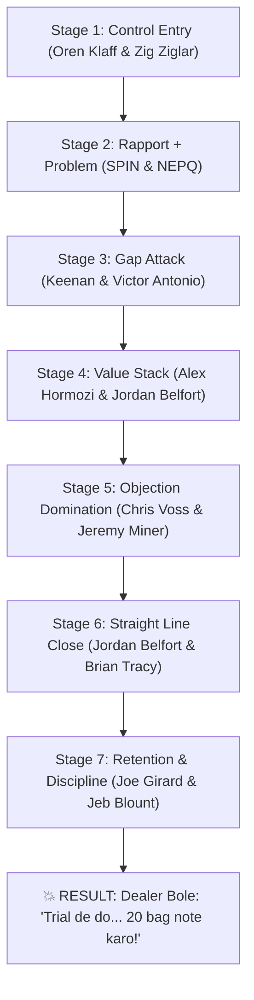

# 🧠 SWATCH PAINTS — SALES MIND CONTROL SYSTEM
### Controlled by Brian Tracy (CSO & Sales Division Execution Commander)
**Governing Executive**: Ashutosh Sharma (CEO & Founder, +91 9079609627)  
**Division**: Sales & Negotiations Division (18 Specialist Legends)  
**Execution Commander**: Brian Tracy (Chief Sales Officer)  
**Core Directive**: Dealer ko convert karna | Same visit me order lena | Repeat system banana | Har visit = Conversion ya strong follow-up!

---

## 🎯 CORE OBJECTIVE & EXECUTIVE SUMMARY

While the **Marketing Mind Control System** (under Philip Kotler) pre-wires regional awareness and customer pull, the **Sales Mind Control System** (under Brian Tracy) governs the exact 7-stage psychological conversion sequence executed face-to-face on the retail counter floor.

- **Objective 1**: Convert skeptical retail paint, hardware, and building material merchants into committed Swatch authorized counters.
- **Objective 2**: Close a 20-bag low-resistance trial order during the **very first visit** without begging or high-pressure tactics.
- **Objective 3**: Establish an automated 18-day reorder cycle backed by strict 7-day payment discipline and zero credit default.

---

## 🧠 THE CORE PRINCIPLE

> ### **“Profit dikhao = Decision lo.”**  
> *(Stop talking about chemical viscosity and resin specs. Show the merchant direct, inarguable cash profit, and the buying decision becomes automatic.)*

---

## 🔥 THE 7-STAGE SYSTEM FLOW



---

### 🟡 STAGE 1: CONTROL ENTRY (Authority & Frame Lock)
**Mission**: Break the pedestrian "salesman" dynamic within 5 seconds. Establish equal-status executive peer authority and commercial scarcity.

#### Tasks:
- Strong physical posture, calm eye contact, warm confident smile.
- Frame the conversation: We are vetting select counters in Hadoti, not begging for shelf space.

#### Specialist Legends:
- **Oren Klaff** (*Frame Control*): Breaks the merchant's dismissal frame with executive brevity:  
  > *“Namaste [Name] ji, main Bundi factory se Swatch Paints se hoon. Hum abhi regional market me limited counters onboard kar rahe hain. 2 minute me check karna tha ki hamara direct factory distribution model aapke counter ke liye fit baithega ya nahi.”*
- **Zig Ziglar** (*Trust Foundation*): Projects sincere warmth and high-character professionalism.

---

### 🟢 STAGE 2: RAPPORT + PROBLEM (Excavating the Counter Pain)
**Mission**: Drop the merchant's guard and illuminate hidden commercial bleeding in their existing business.

#### Tasks:
- Ask about their legacy business history to establish respect.
- Probe the tinting machine Capex trap, dead inventory, and razor-thin legacy brand margins.

#### Specialist Legends:
- **Neil Rackham** (*SPIN Selling*): Probes situation, problem, and implications:  
  > *“Sir legacy brands ke texture me actual net margin kitna bachta hai sab kharche nikaal ke?”*  
  > *“Tinting machine computer lagane me kitna capital block hua tha — ₹3 se ₹4 Lakh?”*
- **Jeremy Miner** (*NEPQ — Neuro-Emotional Persuasion Questioning*): Emotional questions that make the merchant feel the pain of working hard for minimal return.

---

### 🔵 STAGE 3: GAP ATTACK (Reality Shock with Numbers)
**Mission**: Hit the merchant with undeniable mathematical contrast. Reveal the massive financial disparity between legacy monopoly brands and Swatch Paints.

#### Tasks:
- Contrast ₹3-4 Lakh machine investment earning 3-4% margin with zero-machine Swatch earning ₹300-400/bag.
- Present the raw numbers on a yellow pad with visual calculations.

#### Specialist Legends:
- **Keenan** (*Gap Selling*): Illustrates the gulf between Current Bleeding State and Future High-Profit State.
- **Victor Antonio** (*Financial Selling & ROI*): Delivers the mathematical reality shock:  
  > *“Sir simple calculation hai: Aap ₹3–4 Lakh machine me laga ke 3–4% kama rahe ho. Swatch me bina machine har bag par direct ₹300–₹400 ka clean profit hai. 100 bag mahine me nikle to ₹35,000–₹40,000 ka extra net profit banta hai.”*

---


### 🟣 STAGE 4: VALUE STACK (Full Catalog Profit, Ease & Market Pull)
**Mission**: Overwhelm the dealer with irresistible commercial advantages across all 6 Swatch product lines.

#### Tasks:
- Stack zero Capex, 40-45% margins across Textures, Emulsions, and Waterproofing.
- Position Swatch as a complete Factory-Direct Coating System for the entire building.

#### Specialist Legends:
- **Alex Hormozi** (*Grand Slam Offer Architecture*): Stacks the complete risk-free multi-product trial basket:  
  > *“Sir aapko mil raha hai: Zero Machine Capex + ₹400/bag on Rustic & Roller Coat + ₹1,640+ net profit on Weatherguard & Shine 20L buckets + ₹50 Painter Cash Tokens + Free Demo Boards + Inbound Lead Routing.”*
- **Jordan Belfort** (*Straight Line Pitch*): High-certainty communication linking the entire Swatch product catalog to the merchant's annual profitability.

### 🔴 STAGE 5: OBJECTION DOMINATION (Dynamic Resistance Neutralization)
**Mission**: Dissolve dealer hesitations without offering discounts or showing defensiveness.

#### Tasks:
- De-escalate dealer anxiety using Tactical Empathy, Labeling, and Mirroring.
- Re-anchor price against dealer profit and long-term contractor satisfaction.

#### Specialist Legends:
- **Chris Voss** (*Dynamic Negotiation & Tactical Empathy*):  
  - *“Demand nahi hai”* ➔ *“Lagta hai sir aapko lag raha hai ki capital block ho jayega. Sir agar painters ko har bag par ₹50 cash token aur solid quality mile, to kya wo demand nahi karenge?”*  
  - *“Price high hai”* ➔ *“Lagta hai price thoda risky lag raha hai. Sir ₹50 extra raw material quality deke ₹300 extra kamaoge, ye mehenga nahi smart calculation hai.”*
- **Jeremy Miner** (*NEPQ Objection Neutralization*): Labels the hesitation and asks calibrated questions to help the merchant persuade themselves.

---

### ⚫ STAGE 6: CLOSE (Low-Resistance Trial Order)
**Mission**: Secure immediate trial order commitment without friction or debate.

#### Tasks:
- Propose the 20-bag low-risk trial batch.
- Execute the Assumptive Close: Ask ➔ Don't wait. Use the Golden Silent Pause.

#### Specialist Legends:
- **Jordan Belfort** (*Straight Line Closing*):  
  > *“Sir trial ke liye sirf 20 bag Swatch Rustic se start karte hain, risk zero hai. 20 bag note kar deta hoon, delivery kal subah 11:00 baje confirm ho jayegi.”*
- **Brian Tracy** (*Closing Discipline*): Once the closing question is asked — **STRICTLY REMAIN SILENT**. The first person who speaks loses leverage.

---

### 🔁 STAGE 7: RETENTION & PAYMENT DISCIPLINE (The Automated Cash Engine)
**Mission**: Transform a one-off trial order into an institutionalized reorder cycle with zero overdue credit.

#### Tasks:
- Track counter stock velocity; trigger reorders before stock falls below 10 bags.
- Enforce strict 7-day payment SLA with 2% prompt-payment cash discount buffer.

#### Specialist Legends:
- **Joe Girard** (*Customer Retention & 7-Day Credit Collection*): Builds personal relationships with counter staff, tracks thekedar purchases, and enforces 7-day payment collections with warmth and firmness.
- **Jeb Blount** (*Fanatical Follow-Up*): Multi-touch post-sale cadence (Day 1 Visit ➔ Day 2 Video Check ➔ Day 5 Contractor Demo ➔ Day 10 Reorder Call).

---

## 💣 THE FINAL RESULT

When all 7 stages are executed with military discipline on the counter:

```
Dealer lowers his guard ➔ Recognizes existing margin bleed ➔ Sees ₹300-400/bag profit ➔ Overcomes hesitation ➔ Agrees to trial:
“Bhaiya, trial de do... Kal subah 20 bag Swatch Rustic godown me utarwa do!”
```

---

## ⚠️ STRICT OPERATIONAL RULES (TRACY COMMAND)

- ❌ **Product feature dumping is STRICTLY BANNED**: Do not talk about polymer chemistry, dry time, or viscosity unless asked by a technical lab.
- ❌ **Begging / Desperation is BANNED**: Never ask *"Sir ek baar leke dekho na, please"*. You are offering an elite commercial partnership.
- ❌ **Unapproved Price Cuts are BANNED**: Strictly preserve authorized dealer pricing slabs (never quote below official dealer billing rates). Internal manufacturing economics and profit margins are strictly confidential executive secrets (CEO & CFO only).
- ✔ **Sell Profit, Not Paint**: Every conversation anchors on dealer net earnings and contractor pull.

---

## 🎯 THE FINAL GOAL

> ### **“Har visit = Conversion ya strong follow-up!”**  
> *(Zero wasted beats, zero abandoned accounts, predictable weekly dealer growth.)*

---
*Controlled by Brian Tracy (Chief Sales Officer) under the sovereign executive authority of CEO Ashutosh Sharma (+91 9079609627).*
