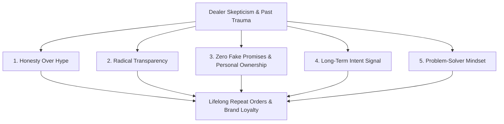

# Zig Ziglar Trust Engine & Long-Term Relationship SOP
## Swatch Paints — Sales & Negotiations Division Standard Operating Procedure (v2.0)

---

### 📌 Document Details
- **Author**: Zig Ziglar (Trust Builder & Relationship Architect)
- **Division**: Sales & Negotiations Division
- **Collaborating Legends**: Brian Tracy (CSO), Jordan Belfort (Straight Line Closer), Jeremy Miner (NEPQ), Neil Rackham (SPIN), Alex Hormozi (Offer Architect), Dan Kennedy (Urgency), Chris Voss (Tactical Empathy)
- **Connected Personnel**: Field Sales Executives, Independent Distributor (Sonu Kumar), Territory Managers
- **Territory**: Rajasthan (Bundi Base/HQ, Kota Expansion Hub, Hadoti Regional City Markets)
- **Status**: Registered for CEO Ashutosh Sharma Signoff (`PENDING_CEO_APPROVAL`)

---

## 1. Executive Purpose: The Economics of Trust in Paint Retail

In the Indian hardware and paint trade, retail dealers are pitched 5 to 10 new products every single week. Most salesmen exaggerate claims, make promises they cannot keep, and vanish once an invoice is cleared.

This creates extreme dealer cynicism. The dealer's default posture is: *“Ye bhi jhooth bol raha hai.”*

**The Zig Ziglar Trust SOP teaches field representatives that radical honesty is the most disarming, profitable sales weapon on earth**:
- When you tell the truth about what your product *cannot* do, the prospect instantly believes everything you say about what it *can* do.
- People don't buy paints; they buy **faith in the integrity of the person standing across the counter**.

> *“People don’t buy products… they buy TRUST in the person selling it.”*  
> *“No trust $\to$ No repeat. No repeat $\to$ No business.”*

---

## 2. Integration in the Master 7-Legend Sales Stack

```text
1. Jordan Belfort    ──► 4-Second Hook & Certainty Frame
2. Jeremy Miner      ──► NEPQ Disarming Questioning (60% Listening)
3. Neil Rackham      ──► SPIN Financial Pain & ₹ Bleed Monetization
4. Alex Hormozi      ──► 7-Layer No-Brainer Offer Stack
5. Dan Kennedy       ──► Direct Response Urgency (Sunday Deadline / Quota)
6. Zig Ziglar        ──► TRUST & RELATIONSHIP GLUE (Authentic Integrity)
7. Chris Voss        ──► Tactical Empathy & Margin Protection (No Discounts)
```

---

## 3. The 5 Pillars of Radical Trust



### Pillar 1: Honesty Over Hype (Admit Reality First)
- Never claim to be the biggest or oldest brand. Openly state that you are an emerging, focused regional specialist.
- **Field Script**:  
  > *“Sir honestly bolu toh Asian Paints jaisa 80 saal ka TV advertising budget hamara nahi hai. Hum cricket match me crodon ke ad nahi dete. Wahi paisa hum dukan par seedha aapko ₹400 clean margin aur thekedar ko ₹50 cash token me pass karte hain.”*

### Pillar 2: Radical Transparency (Zero Fine Print)
- Explain the entire business model openly, including why Swatch chooses not to force expensive tinting machines on retailers.
- **Field Script**:  
  > *“Sir hum transparently batate hain — hum computerized tinting machine isiliye nahi lagwate taaki dukan ka ₹3–4 lakh machine aur color pastes me block na ho. Pure Bundi silica quartz se ready texture aata hai jise thekedar direct deewar par apply karta hai.”*

### Pillar 3: No Fake Promises & Extreme Personal Ownership
- When an issue happens, do not hide behind corporate policy or blame factory workers. Step forward and take personal responsibility.
- **Field Script**:  
  > *“Sir main aapse ye nahi kahunga ki duniya me kabhi koi issue aa hi nahi sakta. Lekin main ye zaroor commit karta hoon: Agar kisi batch me koi flaw aaya, toh company replace karegi aur dukan par aakar main khud use sort out karunga.”*

### Pillar 4: Long-Term Intent Signal (Not a Hit-and-Run)
- Signal to the dealer that you are building an enduring multi-year relationship, not chasing a quick end-of-month target.
- **Field Script**:  
  > *“Sir hum ek baar 20 bag bechkar target poora karke gaayab hone wale salesmen nahi hain. Sharma Industries ka factory setup yahi Bundi me hai. Hum agle 10 saal tak Hadoti ke har counter ke sath imaandari se kaam karne aaye hain.”*

### Pillar 5: Problem-Solver Mindset (Alleviate Risk)
- Frame every Swatch policy around solving a specific dealer headache (slow inventory, contractor retention, painter credit).
- **Field Script**:  
  > *“Sir aapka jo dead stock ya capital block hone ka fear hai, uske liye hum 7-day 100% exchange guarantee dete hain. Hamara maqsad aapki dukan par maal atkana nahi, counter par rotation tez karwana hai.”*

---

## 4. Grounded Field Scenarios & Word-for-Word Dialogues

---

### 🎯 SCENARIO 1: Dealer Is Cautious / Skeptical About a New Brand
- ❌ **Amateur Pitch**: *“Sir le lo, bahut badhiya product hai, sab jagah chal raha hai.”*
- ✅ **Zig Ziglar Integrity Pitch**:  
  > *“Sir honestly bolu toh naye brand par doubt hona 100% natural hai. Agar main aapki jagah baitha hota, toh main bhi bina test kiye kisi par vishwas nahi karta. Isiliye hum aapse 100 bag lene ko nahi bol rahe — sirf ek chhota 20-bag Shubh Aarambh starter trial lijiye. Agar 7 din me painters ka response sahi na lage, toh poora stock bina kisi deduction ke exchange ho jayega. Pehle aap hume test kijiye, fir faisla kijiye.”*

---

### 🎯 SCENARIO 2: Painter Reluctance / Fear of Poor Finish
- ❌ **Amateur Pitch**: *“Bhai tu laga toh sahi, main keh raha hoon na.”*
- ✅ **Zig Ziglar Painter Trust Pitch**:  
  > *“[Painter Name] ji, main aapse jhooth nahi bolunga. Aap pehle 2–3 chhotey panels ya ek sample patch par iska coat chala ke dekho. Agar iska trowel glide, quartz aggregate ki density aur setting time aapko lagane me easy na lage, toh aage mat lagana. Main khud site par aakar replacement de jaunga.”*

---

### 🎯 SCENARIO 3: Dealer Was Cheated by a Past Fly-By-Night Supplier
- ❌ **Amateur Pitch**: *“Wo log alag the sir, hum genuine hain.”*
- ✅ **Zig Ziglar Empathetic Pitch**:  
  > *“Aisa lagta hai past me kisi local supplier ne galat commit karke aapka paisa ya dukan ka vishwas toda hai. Aapka cautious rehna bilkul sahi hai sir — dukan ki saakh banane me 20 saal lagte hain. Isi vajah se Sharma Industries zero-credit par kaam karti hai, 100% transparent pricing rakhti hai, aur Bundi HQ factory se direct connect karti hai. Hum pehle vishwas kamayenge, fir dukan par bada order lenge.”*

---

## 5. The 5-Point Daily Trust Checklist for Field Reps

Before leaving every counter, the sales representative must internally verify:
1. [ ] **Did I speak with radical honesty without boasting?**
2. [ ] **Did I avoid making even a single unfulfillable overpromise?**
3. [ ] **Did I clearly remove their inventory risk (7-day exchange guarantee)?**
4. [ ] **Did I take personal ownership of quality and service?**
5. [ ] **Did I demonstrate a long-term partnership commitment instead of hit-and-run selling?**

---

## 6. The 4 Golden Pillars of Long-Term Trust
- **Consistency**: Deliver exactly what was promised every single time.
- **Visibility**: Show up on the scheduled beat week after week, whether they buy or not.
- **Responsiveness**: Answer dealer and painter phone calls immediately, especially when there is a complaint.
- **Ownership**: Own problems instantly. Never blame factory workers or logistics helpers.
